# ĐẶC TẢ YÊU CẦU PHẦN MỀM (SOFTWARE REQUIREMENTS SPECIFICATION - SRS)
## HỆ THỐNG THƯƠNG MẠI ĐIỆN TỬ KHÔNG GIAN 3D & CỔNG THANH TOÁN SZ-PAYMENT (SZSHOP)
**Tiêu chuẩn áp dụng:** IEEE Std 830-1998 / ISO/IEC/IEEE 29148:2018  
**Phiên bản:** 2.0 (Bản hoàn thiện tích hợp 3D Spatial Canvas & AI Copilot)  
**Ngày phát hành:** 07/09/2026  
**Đơn vị thực hiện:** Nhóm Phát triển Nền tảng E-Commerce SZSHOP  

---

## MỤC LỤC TỔNG THỂ
1. [GIỚI THIỆU CHUNG](#1-giới-thiệu-chung)
   - [1.1 Mục đích](#11-mục-đích)
   - [1.2 Phạm vi](#12-phạm-vi)
   - [1.3 Các định nghĩa, thuật ngữ, từ viết tắt](#13-các-định-nghĩa-thuật-ngữ-từ-viết-tắt)
   - [1.4 Tài liệu tham khảo](#14-tài-liệu-tham-khảo)
2. [MÔ TẢ TỔNG QUAN ỨNG DỤNG](#2-mô-tả-tổng-quan-ứng-dụng)
   - [2.1 Mô hình Use Case tổng thể](#21-mô-hình-use-case-tổng-thể)
   - [2.2 Danh sách các tác nhân và mô tả](#22-danh-sách-các-tác-nhân-và-mô-tả)
   - [2.3 Danh sách Use Case và mô tả](#23-danh-sách-use-case-và-mô-tả)
   - [2.4 Các điều kiện phụ thuộc](#24-các-điều-kiện-phụ-thuộc)
3. [ĐẶC TẢ CÁC YÊU CẦU CHỨC NĂNG (FUNCTIONAL REQUIREMENTS)](#3-đặc-tả-các-yêu-cầu-chức-năng-functional-requirements)
   - [3.1 UC001_Đăng ký, Đăng nhập & Xác thực Hệ thống](#31-uc001_đăng-ký-đăng-nhập--xác-thực-hệ-thống)
     - [3.1.1 Mô tả use case UC001](#311-mô-tả-use-case-uc001)
     - [3.1.2 Biểu đồ UC001](#312-biểu-đồ-uc001)
   - [3.2 UC002_Khám phá & Tìm kiếm Sản phẩm Không gian 3D](#32-uc002_khám-phá--tìm-kiếm-sản-phẩm-không-gian-3d)
     - [3.2.1 Mô tả use case UC002](#321-mô-tả-use-case-uc002)
     - [3.2.2 Biểu đồ UC002](#322-biểu-đồ-uc002)
   - [3.3 UC003_Quản lý Giỏ hàng Đa năng (Cart Management & MiniCart)](#33-uc003_quản-lý-giỏ-hàng-đa-năng-cart-management--minicart)
     - [3.3.1 Mô tả use case UC003](#331-mô-tả-use-case-uc003)
     - [3.3.2 Biểu đồ UC003](#332-biểu-đồ-uc003)
   - [3.4 UC004_Xác nhận Đơn hàng & Thiết lập Giao nhận (Checkout)](#34-uc004_xác-nhận-đơn-hàng--thiết-lập-giao-nhận-checkout)
     - [3.4.1 Mô tả use case UC004](#341-mô-tả-use-case-uc004)
     - [3.4.2 Biểu đồ UC004](#342-biểu-đồ-uc004)
   - [3.5 UC005_Thanh toán Trực tuyến Đa kênh SZ-Payment Gateway](#35-uc005_thanh-toán-trực-tuyến-đa-kênh-sz-payment-gateway)
     - [3.5.1 Mô tả use case UC005](#351-mô-tả-use-case-uc005)
     - [3.5.2 Biểu đồ UC005](#352-biểu-đồ-uc005)
   - [3.6 UC006_Tra cứu Tiến trình Vận đơn & Quản lý Đơn hàng](#36-uc006_tra-cứu-tiến-trình-vận-đơn--quản-lý-đơn-hàng)
     - [3.6.1 Mô tả use case UC006](#361-mô-tả-use-case-uc006)
     - [3.6.2 Biểu đồ UC006](#362-biểu-đồ-uc006)
   - [3.7 UC007_Trợ lý AI Mua sắm & Phân tích Doanh số ZShop Copilot](#37-uc007_trợ-lý-ai-mua-sắm--phân-tích-doanh-số-zshop-copilot)
     - [3.7.1 Mô tả use case UC007](#371-mô-tả-use-case-uc007)
     - [3.7.2 Biểu đồ UC007](#372-biểu-đồ-uc007)
   - [3.8 UC008_Quản lý Kênh Nhà bán lẻ (Seller Channel)](#38-uc008_quản-lý-kênh-nhà-bán-lẻ-seller-channel)
     - [3.8.1 Mô tả use case UC008](#381-mô-tả-use-case-uc008)
     - [3.8.2 Biểu đồ UC008](#382-biểu-đồ-uc008)
   - [3.9 UC009_Quản trị Sàn E-Commerce (Admin Dashboard)](#39-uc009_quản-trị-sàn-e-commerce-admin-dashboard)
     - [3.9.1 Mô tả use case UC009](#391-mô-tả-use-case-uc009)
     - [3.9.2 Biểu đồ UC009](#392-biểu-đồ-uc009)
4. [CÁC THÔNG TIN HỖ TRỢ KHÁC](#4-các-thông-tin-hỗ-trợ-khác)
   - [4.1 Yêu cầu phi chức năng (Non-Functional Requirements)](#41-yêu-cầu-phi-chức-năng-non-functional-requirements)
   - [4.2 Thiết kế Cơ sở Dữ liệu Quan hệ Vật lý (11 Bảng SQL)](#42-thiết-kế-cơ-sở-dữ-liệu-quan-hệ-vật-lý-11-bảng-sql)
   - [4.3 Ràng buộc Thiết kế & Kiến trúc Triển khai](#43-ràng-buộc-thiết-kế--kiến-trúc-triển-khai)

---

# 1. GIỚI THIỆU CHUNG

## 1.1 Mục đích
Tài liệu Đặc tả Yêu cầu Phần mềm (Software Requirements Specification - SRS) này mô tả chi tiết, toàn diện và đầy đủ các yêu cầu nghiệp vụ, yêu cầu chức năng, yêu cầu phi chức năng, các ràng buộc kỹ thuật, kiến trúc giao diện tương tác 3D WebGL và cơ sở dữ liệu quan hệ của **Hệ thống Thương mại Điện tử Không gian 3D & Cổng Thanh toán SZ-Payment (SZSHOP / ZS-Economy)**.

Mục đích cụ thể của tài liệu:
1. **Chuẩn hóa nghiệp vụ:** Thiết lập tài liệu cơ sở kỹ thuật chính thức theo tiêu chuẩn công nghiệp IEEE Std 830-1998, bảo đảm sự thống nhất tuyệt đối giữa đội ngũ phân tích nghiệp vụ, lập trình viên, chuyên viên kiểm thử (QA/QC), quản lý dự án và các bên liên quan.
2. **Hướng dẫn thiết kế & phát triển:** Làm kim chỉ nam cho việc xây dựng kiến trúc frontend (React 19 + Three.js), backend micro-services (Node.js/Express v5), hệ thống cơ sở dữ liệu (Microsoft SQL Server) và tích hợp các mô hình trí tuệ nhân tạo (Google Gemini RAG AI Copilot).
3. **Tiêu chuẩn nghiệm thu:** Định nghĩa tiêu chuẩn kiểm thử tự động, kiểm thử chấp nhận người dùng (UAT), xác thực hiệu năng hệ thống đồ họa 3D và đối soát giao dịch cổng thanh toán thời gian thực.

## 1.2 Phạm vi
- **Tên sản phẩm:** Hệ thống Thương mại Điện tử Tương tác Không gian 3D & Cổng Thanh toán Số Đa kênh (Tên thương mại: **SZSHOP** hoặc **ZS-Economy Gateway**).
- **Phạm vi giải quyết bài toán:**
  - *Đột phá trải nghiệm người dùng:* Chuyển đổi mô hình hiển thị danh mục ảnh 2D tĩnh truyền thống sang không gian đồ họa tương tác 3D tương tác thời gian thực (Three.js WebGL canvas), cho phép người mua xoay 360°, phóng to chi tiết bề mặt vật liệu, tương tác thẻ sản phẩm Bento Grid 3D chiều sâu.
  - *Cổng thanh toán tự động & đa kênh SZ-Payment:* Tích hợp cơ chế thanh toán liên ngân hàng và ví điện tử: VietQR Napas 247, VNPAY-QR, Thẻ quốc tế Visa/Mastercard, Ví MoMo và thanh toán khi nhận hàng (COD có kiểm soát ngưỡng rủi ro). Tự động sinh mã thanh toán kèm thời gian đếm ngược 15 phút, cập nhật trạng thái đơn hàng tức thời qua webhook.
  - *Trợ lý trí tuệ nhân tạo ZShop Copilot:* Ứng dụng công nghệ RAG (Retrieval-Augmented Generation) kết hợp Large Language Model Gemini nhằm tự động hóa 6 kịch bản nghiệp vụ: Tư vấn sản phẩm theo ngân sách, lọc danh mục theo tiêu chuẩn kỹ thuật, thêm nhanh vào giỏ hàng từ cửa sổ chat, tra cứu tiến độ vận đơn, phân tích doanh thu sàn cho Quản trị viên, và AI Copywriter sáng tạo nội dung cho Nhà bán lẻ.
  - *Mô hình đa tác nhân (Multi-vendor Marketplace):* Hỗ trợ đầy đủ phân hệ dành cho Khách mua hàng (Customer), Kênh Nhà bán hàng (Seller Channel - quản lý tồn kho, đơn hàng, ví tiền shop), và Bảng điều khiển Quản trị viên (Admin Dashboard - phê duyệt shop, duyệt sản phẩm, phân tích tài chính toàn sàn).
- **Giới hạn phạm vi (Out of Scope):** Hệ thống không trực tiếp vận hành xe giao hàng vật lý ngoài đời thực mà tích hợp trạng thái API đối tác vận chuyển; hệ thống cung cấp môi trường giả lập đối soát tài chính lượng tử (Sandbox Gateway) kết hợp mã QR tĩnh/động.

## 1.3 Các định nghĩa, thuật ngữ, từ viết tắt
| Thuật ngữ / Viết tắt | Tên tiếng Anh đầy đủ | Định nghĩa & Ý nghĩa kỹ thuật |
| :--- | :--- | :--- |
| **SRS** | Software Requirements Specification | Tài liệu đặc tả yêu cầu phần mềm theo tiêu chuẩn IEEE 830. |
| **UI / UX** | User Interface / User Experience | Giao diện người dùng đồ họa và Trải nghiệm tương tác người dùng. |
| **Three.js** | Three.js WebGL 3D Engine | Thư viện JavaScript chuyên dụng kết xuất đồ họa 3D tương tác trên trình duyệt không cần cài plugin. |
| **WebGL** | Web Graphics Library | Tiêu chuẩn web cho phép dựng hình đồ họa 3D tăng tốc phần cứng thông qua chip GPU. |
| **RAG** | Retrieval-Augmented Generation | Kỹ thuật kết hợp truy xuất dữ liệu có cấu trúc từ cơ sở dữ liệu với mô hình ngôn ngữ lớn để trả lời chính xác, chống ảo giác (hallucination). |
| **LLM** | Large Language Model | Mô hình ngôn ngữ lớn (Google Gemini 1.5 Flash / Pro). |
| **VietQR** | Vietnam Quick Response Code Standard | Chuẩn mã QR thanh toán liên ngân hàng quốc gia do Napas và Ngân hàng Nhà nước Việt Nam ban hành. |
| **VNPAY-QR** | Vietnam Payment QR Gateway | Cổng thanh toán quét mã QR hỗ trợ hơn 40 ứng dụng ngân hàng và ví điện tử. |
| **COD** | Cash On Delivery | Hình thức thanh toán bằng tiền mặt khi người mua nhận kiện hàng. |
| **JWT** | JSON Web Token | Chuẩn mã hóa chuỗi ký tự an toàn truyền tải giữa client và server để xác thực phiên đăng nhập. |
| **SSO** | Single Sign-On | Cơ chế đăng nhập một chạm qua Google OAuth 2.0 / Apple Sign-in. |
| **SKU** | Stock Keeping Unit | Đơn vị định danh quản lý hàng hóa và thuộc tính biến thể trong kho hàng. |
| **ACID** | Atomicity, Consistency, Isolation, Durability | 4 thuộc tính bảo đảm tính toàn vẹn tuyệt đối của các giao dịch cơ sở dữ liệu quan hệ. |

## 1.4 Tài liệu tham khảo
1. IEEE Std 830-1998: *IEEE Recommended Practice for Software Requirements Specifications*, IEEE Computer Society, 1998.
2. ISO/IEC/IEEE 29148:2018: *Systems and software engineering — Life cycle processes — Requirements engineering*.
3. Napas: *Đặc tả tiêu chuẩn kết nối kỹ thuật chuyển mạch tài chính và Cổng thanh toán VietQR Napas 247*, 2023.
4. Google Cloud: *Gemini API Documentation & Prompt Engineering Best Practices for Enterprise RAG*, 2024.
5. Three.js Documentation (r160): *Scene graph, PBR Materials, Camera Controls and WebGLRenderer pipeline*.
6. Kho mã nguồn và tài liệu kiến trúc dự án SZSHOP: `_Web_ZShop-main` (Vite, React 19, Express 5, Microsoft SQL Server).

---

# 2. MÔ TẢ TỔNG QUAN ỨNG DỤNG

## 2.1 Mô hình Use Case tổng thể
Hệ thống SZSHOP phục vụ 4 tác nhân con người tương tác qua giao diện đồ họa web và 2 tác nhân dịch vụ bên thứ ba:

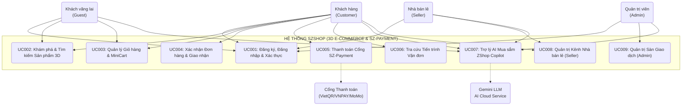
```mermaid
graph TB
    subgraph "HỆ THỐNG SZSHOP (3D E-COMMERCE & SZ-PAYMENT)"
        UC001("UC001: Đăng ký, Đăng nhập & Xác thực")
        UC002("UC002: Khám phá & Tìm kiếm Sản phẩm 3D")
        UC003("UC003: Quản lý Giỏ hàng & MiniCart")
        UC004("UC004: Xác nhận Đơn hàng & Giao nhận")
        UC005("UC005: Thanh toán Cổng SZ-Payment")
        UC006("UC006: Tra cứu Tiến trình Vận đơn")
        UC007("UC007: Trợ lý AI Mua sắm ZShop Copilot")
        UC008("UC008: Quản trị Kênh Nhà bán lẻ (Seller)")
        UC009("UC009: Quản trị Sàn Giao dịch (Admin)")
    end

    Guest("Khách vãng lai<br/>(Guest)")
    Customer("Khách hàng<br/>(Customer)")
    Seller("Nhà bán lẻ<br/>(Seller)")
    Admin("Quản trị viên<br/>(Admin)")
    PaymentGW("Cổng Thanh toán<br/>(VietQR/VNPAY/MoMo)")
    AIService("Gemini LLM<br/>AI Cloud Service")

    Guest --> UC001
    Guest --> UC002
    Guest --> UC003
    Guest --> UC007

    Customer --> UC001
    Customer --> UC002
    Customer --> UC003
    Customer --> UC004
    Customer --> UC005
    Customer --> UC006
    Customer --> UC007
    Customer --> UC008

    Seller --> UC001
    Seller --> UC008
    Seller --> UC007

    Admin --> UC001
    Admin --> UC009
    Admin --> UC007

    UC005 -.-> PaymentGW
    UC007 -.-> AIService
```

## 2.2 Danh sách các tác nhân và mô tả
| STT | Tác nhân (Actor) | Vai trò & Trách nhiệm nghiệp vụ trong hệ thống |
| :---: | :--- | :--- |
| 1 | **Khách vãng lai (Guest)** | Người dùng chưa xác thực danh tính. Có quyền truy cập Landing Page 3D, duyệt catalog sản phẩm, tương tác mô hình 3D, tìm kiếm từ khóa, thêm sản phẩm vào Giỏ hàng tạm (Local Cart) và chat trải nghiệm với AI Copilot. Khi bấm "Xác nhận đặt hàng" hoặc đăng ký mở Shop sẽ được điều hướng đến màn hình Đăng nhập/Đăng ký. |
| 2 | **Khách hàng (Customer)** | Người dùng đã đăng ký tài khoản và đăng nhập thành công. Có toàn quyền quản lý giỏ hàng, đặt hàng (Checkout), chọn mã giảm giá, thực hiện thanh toán trực tuyến qua cổng SZ-Payment, theo dõi đơn hàng thời gian thực qua mã vận đơn `DH-XXXXXXXX`, gửi yêu cầu hủy đơn, và đánh giá phản hồi sản phẩm. |
| 3 | **Nhà bán lẻ (Seller)** | Người dùng sở hữu cửa hàng kinh doanh trên sàn (Shop). Có quyền truy cập `SellerChannelPage` để đăng tải sản phẩm mới (tên, giá, số lượng tồn kho, hình ảnh, phân loại), sửa/xóa sản phẩm trong danh mục của mình, theo dõi các kiện hàng được đặt, xem số dư ví người bán (Wallet Balance), và kích hoạt AI Copywriter để sinh nội dung quảng bá. |
| 4 | **Quản trị viên (Admin)** | Người dùng có đặc quyền cao nhất trong hệ thống. Truy cập `AdminDashboard` để giám sát toàn bộ chỉ số kinh doanh sàn (tổng doanh thu, doanh số theo ngày, tổng số đơn), phê duyệt hoặc từ chối đơn đăng ký mở shop của người bán mới (`globalSellers`), kiểm duyệt chất lượng sản phẩm toàn sàn, quản lý danh mục và cấu hình phí hoa hồng sàn (commission fee). |
| 5 | **Cổng thanh toán bên thứ ba (Payment Gateway)** | Hệ thống ngoài bao gồm Cổng VietQR Napas 247, VNPAY, MoMo Sandbox và Cổng Thẻ Quốc tế. Chịu trách nhiệm khởi tạo mã thanh toán QR động, xác nhận tiền vào tài khoản và bắn tín hiệu webhook phản hồi trạng thái giao dịch cho Backend SZSHOP. |
| 6 | **Dịch vụ AI Ngoài (Google Gemini Service)** | Hệ thống ngoài cung cấp API Generative Language. Nhận câu hỏi tự nhiên từ người dùng kèm ngữ cảnh RAG (danh mục sản phẩm, lịch sử mua sắm, doanh số đơn hàng) để sinh câu trả lời tư vấn mua sắm, lọc sản phẩm và xuất dữ liệu JSON có cấu trúc. |

## 2.3 Danh sách Use Case và mô tả
| Mã UC | Tên Ca Sử Dụng | Phân hệ (Module) | Tác nhân chính | Tóm tắt chức năng | Mức ưu tiên |
| :---: | :--- | :--- | :--- | :--- | :---: |
| **UC001** | Đăng ký, Đăng nhập & Xác thực | Xác thực (Auth) | Guest, Customer, Seller, Admin | Đăng nhập/Đăng ký bằng Email & Mật khẩu; Đăng nhập một chạm bằng Google OAuth, Apple Sign-in; Khôi phục mật khẩu qua email; Quản lý phiên JWT và phân quyền vai trò. | Rất cao |
| **UC002** | Khám phá & Tìm kiếm Sản phẩm 3D | Sản phẩm (Catalog) | Guest, Customer | Hiển thị Banner 3D tương tác WebGL (xoay mô hình 360°, hiệu ứng ánh sáng); Bento Grid 3D; Lưới sản phẩm Flash Sale & Phân loại danh mục; Tìm kiếm từ khóa thời gian thực; Xem trang chi tiết sản phẩm kèm chọn biến thể (Màu sắc, Size). | Rất cao |
| **UC003** | Quản lý Giỏ hàng & MiniCart | Giỏ hàng (Cart) | Guest, Customer | Thêm sản phẩm và biến thể vào giỏ; Mở bảng trượt MiniCart từ thanh điều hướng; Tăng, giảm số lượng mặt hàng; Xóa item khỏi giỏ; Tự động tính toán tổng tiền tạm tính. | Cao |
| **UC004** | Xác nhận Đơn hàng & Giao nhận | Đơn hàng (Checkout) | Customer | Kiểm tra danh sách mặt hàng đặt mua; Nhập thông tin người nhận (Họ tên, SĐT, Địa chỉ nhận hàng); Áp dụng mã khuyến mãi Voucher (SZWELCOME, FREESHIP, SALE50); Chấp thuận điều khoản và khởi tạo đơn hàng trạng thái PENDING. | Cao |
| **UC005** | Thanh toán Đa kênh SZ-Payment | Thanh toán (Payment) | Customer, Payment Gateway | Lựa chọn phương thức thanh toán (VNPAY-QR, VietQR Napas 247, Thẻ quốc tế, MoMo, COD); Kiểm tra điều kiện áp dụng (ràng buộc COD <= 5 triệu); Sinh mã QR động kèm thời gian hết hạn 15 phút; Tiếp nhận xác nhận thanh toán; Xuất hóa đơn số 3D kèm mã giao dịch TRX và hiệu ứng confetti. | Rất cao |
| **UC006** | Tra cứu Tiến trình Vận đơn | Vận đơn (Tracking) | Customer, Guest | Tra cứu trạng thái đơn hàng theo mã đơn (DH-YYYYMMDD); Hiển thị timeline tiến trình trực quan 5 mốc: Chờ duyệt, Đã thanh toán, Đang đóng gói, Đang giao hàng, Đã giao thành công; Hỗ trợ gửi yêu cầu hủy đơn hàng đối với đơn chưa giao. | Trung bình |
| **UC007** | Trợ lý AI Mua sắm ZShop Copilot | Trí tuệ nhân tạo (AI RAG) | Guest, Customer, Seller, Admin | Trò chuyện tự nhiên với Trợ lý AI tích hợp 6 Business Skills: Tư vấn theo ngân sách người dùng, lọc danh mục sản phẩm, thêm nhanh vào giỏ hàng bằng 1 click trong chat, tra cứu đơn tức thì, báo cáo doanh số tổng hợp cho Admin, và AI Copywriter sinh bài viết bán hàng cho Seller. | Cao |
| **UC008** | Quản lý Kênh Nhà bán lẻ | Kênh Seller | Seller, Customer | Gửi hồ sơ đăng ký mở cửa hàng; Quản lý thông tin Shop; Đăng bán sản phẩm mới (tên, giá, ảnh, tồn kho); Cập nhật và xóa sản phẩm kho; Theo dõi các kiện hàng phát sinh; Quản lý số dư ví người bán. | Cao |
| **UC009** | Quản trị Sàn E-Commerce | Bảng điều khiển Admin | Admin | Giám sát KPI sàn (Doanh thu tuần, lượng đơn hàng, số lượng khách); Phê duyệt hoặc từ chối hồ sơ đăng ký mở Shop; Kiểm duyệt và cập nhật thông tin sản phẩm toàn hệ thống; Xuất báo cáo tài chính sàn. | Cao |

## 2.4 Các điều kiện phụ thuộc
1. **Môi trường kết nối mạng & Băng thông:**
   - Hệ thống yêu cầu đường truyền Internet liên tục giữa máy khách và máy chủ với băng thông tối thiểu 2 Mbps để truyền tải mô hình 3D (file GLTF/OBJ/Textures dung lượng 1MB - 5MB) và nhận diện luồng phản hồi streaming từ mô hình trí tuệ nhân tạo.
2. **Yêu cầu hỗ trợ đồ họa phần cứng WebGL trên Client:**
   - Thiết bị người dùng (PC, Laptop, Smartphone, Tablet) phải sở hữu trình điều khiển đồ họa (GPU driver) hỗ trợ chuẩn WebGL 2.0. Các trình duyệt tương thích bao gồm: Google Chrome v100 trở lên, Microsoft Edge v100 trở lên, Mozilla Firefox v110 trở lên, Apple Safari v16 trở lên.
3. **Môi trường hạ tầng máy chủ & Cơ sở dữ liệu:**
   - Máy chủ ứng dụng Backend chạy môi trường thực thi Node.js (phiên bản khuyến nghị LTS v18.x hoặc v20.x, Express v5.2.1).
   - Hệ thống lưu trữ dữ liệu chính thức kết nối cơ sở dữ liệu quan hệ Microsoft SQL Server (MSSQL 2019 / 2022). Trong trường hợp ngắt kết nối mạng doanh nghiệp, tầng dịch vụ Frontend/Backend kích hoạt cơ chế Fallback sang kho lưu trữ cục bộ (In-Memory Mock Database) bảo đảm độ sẵn sàng 100% không bị gián đoạn trải nghiệm người dùng.
4. **Phụ thuộc vào các dịch vụ đám mây bên thứ ba:**
   - Dịch vụ xác thực danh tính Google OAuth 2.0 (Google Identity Services Client ID) và Apple Sign-in Services.
   - Cổng kết nối API Napas247 / VietQR để định dạng chuỗi mã QR thanh toán chuẩn EMVCo.
   - API Google Gemini 1.5 Flash / Pro (Google AI Studio) với hạn mức API Key hoạt động ổn định phục vụ tính năng AI Sales Copilot.

---

# 3. ĐẶC TẢ CÁC YÊU CẦU CHỨC NĂNG (FUNCTIONAL REQUIREMENTS)

## 3.1 UC001_Đăng ký, Đăng nhập & Xác thực Hệ thống

### 3.1.1 Mô tả use case UC001
- **Tên Use Case:** Đăng ký, Đăng nhập & Xác thực Hệ thống (User Authentication & SSO Module).
- **Mã định danh:** `UC001`.
- **Tác nhân tham gia:** Khách vãng lai (Guest), Khách hàng (Customer), Nhà bán lẻ (Seller), Quản trị viên (Admin).
- **Mục đích:** Cung cấp giải pháp nhận dạng, đăng ký tài khoản mới, xác thực thông tin đăng nhập đa kênh (Email/Mật khẩu và Single Sign-On qua Google/Facebook/Apple), khôi phục mật khẩu, khởi tạo phiên làm việc bảo mật (JWT) và phân quyền vai trò người dùng vào các phân hệ chức năng tương ứng.
- **Tiền điều kiện:** Người dùng đã truy cập vào hệ thống SZSHOP và có kết nối Internet ổn định.
- **Hậu điều kiện:**
  - Nếu xác thực thành công: Hệ thống lưu phiên đăng nhập (JWT token và thông tin UserRole), giao diện chuyển hướng về trang đích tương ứng (Khách hàng về Trang chủ/Giỏ hàng; Seller về SellerChannel; Admin về AdminDashboard).
  - Nếu thất bại: Phiên làm việc không được cấp phát, hệ thống hiển thị thông báo lỗi cụ thể để người dùng thao tác lại.
- **Luồng sự kiện chính (Basic Flow - Đăng nhập chuẩn):**
  1. Người dùng bấm chọn nút "Đăng nhập" trên thanh điều hướng Header.
  2. Hệ thống hiển thị giao diện Màn hình Đăng nhập (`LoginPage.tsx`) gồm ô nhập Email, Mật khẩu, nút "Đăng nhập", tùy chọn "Quên mật khẩu?", liên kết "Đăng ký ngay" và các nút đăng nhập nhanh qua Google / Facebook / Apple.
  3. Người dùng nhập địa chỉ Email và Mật khẩu hợp lệ, sau đó nhấn nút "ĐĂNG NHẬP".
  4. Hệ thống client kiểm tra định dạng dữ liệu (email đúng cấu trúc, mật khẩu không để trống), sau đó gửi yêu cầu `POST /api/auth/login` kèm payload `{ email, password }` đến Backend server.
  5. Backend thực hiện truy vấn bảng `Users` trong SQL Server theo email:
     - Kiểm tra sự tồn tại của tài khoản.
     - So khớp chuỗi băm mật khẩu (Hash verification).
     - Đọc vai trò tương ứng từ bảng `Roles` (`CUSTOMER`, `SELLER`, hoặc `ADMIN`).
  6. Backend khởi tạo mã JWT token chứa `userId`, `email`, `role` và phản hồi kết quả `{ success: true, token, user }`.
  7. Frontend lưu trữ token, cập nhật trạng thái `userRole` trên toàn bộ ứng dụng và chuyển hướng người dùng đến giao diện phù hợp:
     - Vai trò `ADMIN`: Chuyển hướng đến `AdminDashboard`.
     - Vai trò `SELLER`: Chuyển hướng đến `SellerChannelPage`.
     - Vai trò `CUSTOMER`: Giữ nguyên trang hiện tại hoặc chuyển về `ShopeeHomePage` với trạng thái đã đăng nhập.
- **Các luồng thay thế & Luồng ngoại lệ (Alternative & Exception Flows):**
  - *Luồng thay thế 1 (Đăng ký tài khoản mới):* Tại bước 2, người dùng bấm "Đăng ký ngay". Hệ thống hiển thị `RegisterPage.tsx`. Người dùng nhập Họ tên, Email, Mật khẩu, Xác nhận mật khẩu. Frontend gọi `POST /api/auth/register`. Backend kiểm tra email chưa tồn tại, tạo bản ghi mới trong bảng `Users` và `Customers`, tự động gán vai trò `CUSTOMER` và trả về thông báo tạo tài khoản thành công.
  - *Luồng thay thế 2 (Đăng nhập một chạm Google OAuth SSO):* Tại bước 2, người dùng bấm nút biểu tượng Google. Modal chọn tài khoản Google xuất hiện. Người dùng chọn tài khoản Google có sẵn hoặc nhập email cá nhân. Frontend gửi `POST /api/auth/social-login` kèm `{ provider: 'google', token, profile }`. Backend kiểm tra trong bảng `Users` với điều kiện `provider = 'google'` và `provider_user_id`. Nếu tài khoản chưa từng tồn tại, backend tự động khởi tạo User mới với vai trò `CUSTOMER` mà không bắt buộc nhập mật khẩu.
  - *Luồng thay thế 3 (Quên mật khẩu):* Tại bước 2, người dùng bấm "Quên mật khẩu?". Hệ thống hiển thị `ForgotPasswordPage.tsx`. Người dùng nhập Email đã đăng ký và bấm "Gửi yêu cầu". Backend kiểm tra email, tạo mã liên kết đặt lại mật khẩu và gửi email hướng dẫn khôi phục.
  - *Luồng ngoại lệ 1 (Sai thông tin đăng nhập):* Tại bước 5, nếu email không tồn tại hoặc mật khẩu sai, Backend trả về mã lỗi HTTP 401 `{ success: false, error: 'Email hoặc mật khẩu không chính xác' }`. Frontend hiển thị cảnh báo viền đỏ trên ô nhập liệu và giữ nguyên dữ liệu để người dùng thử lại.
  - *Luồng ngoại lệ 2 (Lỗi kết nối máy chủ CSDL):* Nếu dịch vụ SQL Server gặp sự cố kết nối, hệ thống chuyển sang chế độ Local Fallback Mode, thông báo trạng thái ngoại tuyến hoặc cho phép người dùng đăng nhập bằng tài khoản thử nghiệm nội bộ (`admin@szshop.vn`, `seller@szshop.vn`, `customer@szshop.vn`).

### 3.1.2 Biểu đồ UC001

#### Biểu đồ hoạt động (Activity Diagram) - Xác thực người dùng
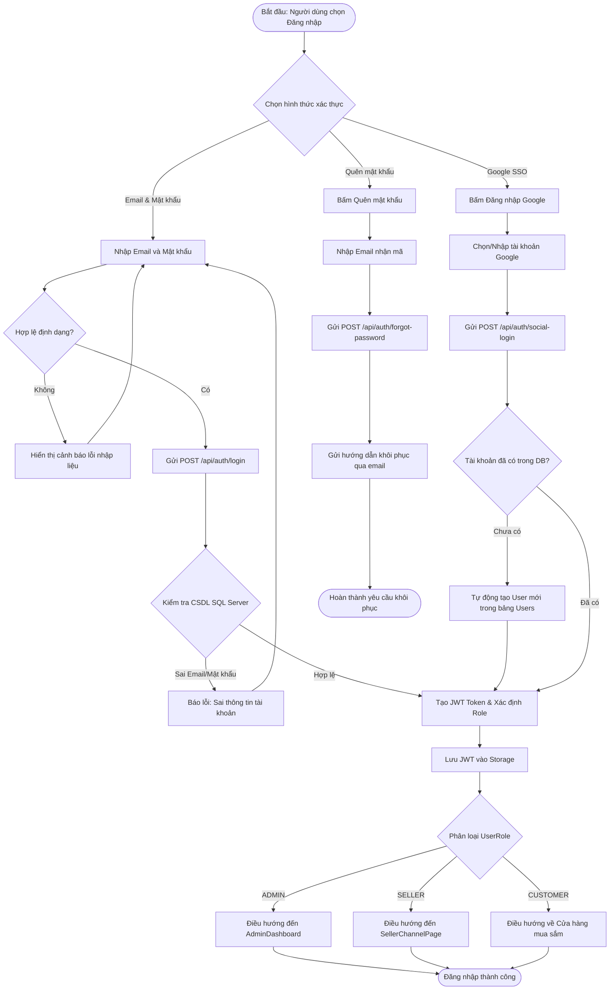
```mermaid
flowchart TD
    Start([Bắt đầu: Người dùng chọn Đăng nhập]) --> Choice{Chọn hình thức xác thực}
    
    %% Luồng Email/Password
    Choice -- Email & Mật khẩu --> InputCreds[Nhập Email và Mật khẩu]
    InputCreds --> ValidateClient{Hợp lệ định dạng?}
    ValidateClient -- Không --> ShowErr1[Hiển thị cảnh báo lỗi nhập liệu] --> InputCreds
    ValidateClient -- Có --> SendAuthReq[Gửi POST /api/auth/login]
    SendAuthReq --> CheckDB{Kiểm tra CSDL SQL Server}
    CheckDB -- Sai Email/Mật khẩu --> ShowErr2[Báo lỗi: Sai thông tin tài khoản] --> InputCreds
    CheckDB -- Hợp lệ --> GenToken[Tạo JWT Token & Xác định Role]
    
    %% Luồng Google SSO
    Choice -- Google SSO --> ClickGoogle[Bấm Đăng nhập Google]
    ClickGoogle --> SelectAccount[Chọn/Nhập tài khoản Google]
    SelectAccount --> SendGoogleReq[Gửi POST /api/auth/social-login]
    SendGoogleReq --> CheckGoogleUser{Tài khoản đã có trong DB?}
    CheckGoogleUser -- Chưa có --> AutoCreate[Tự động tạo User mới trong bảng Users] --> GenToken
    CheckGoogleUser -- Đã có --> GenToken
    
    %% Luồng Quên mật khẩu
    Choice -- Quên mật khẩu --> ClickForgot[Bấm Quên mật khẩu]
    ClickForgot --> InputForgotMail[Nhập Email nhận mã]
    InputForgotMail --> SendResetReq[Gửi POST /api/auth/forgot-password]
    SendResetReq --> SendMailNotice[Gửi hướng dẫn khôi phục qua email] --> EndForgot([Hoàn thành yêu cầu khôi phục])

    %% Phân quyền giao diện
    GenToken --> SaveSession[Lưu JWT vào Storage]
    SaveSession --> RouteRole{Phân loại UserRole}
    RouteRole -- ADMIN --> NavAdmin[Điều hướng đến AdminDashboard] --> EndAuth([Đăng nhập thành công])
    RouteRole -- SELLER --> NavSeller[Điều hướng đến SellerChannelPage] --> EndAuth
    RouteRole -- CUSTOMER --> NavHome[Điều hướng về Cửa hàng mua sắm] --> EndAuth
```

#### Biểu đồ tuần tự (Sequence Diagram) - Đăng nhập hệ thống
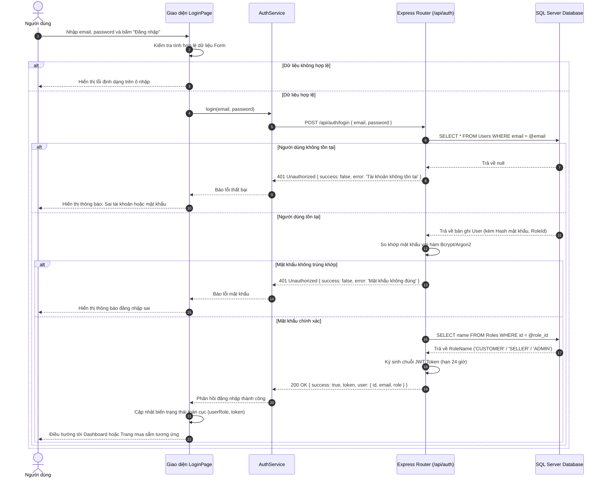
```mermaid
sequenceDiagram
    autonumber
    actor User as Người dùng
    participant UI as Giao diện LoginPage
    participant Service as AuthService
    participant API as Express Router (/api/auth)
    participant DB as SQL Server Database

    User->>UI: Nhập email, password và bấm "Đăng nhập"
    UI->>UI: Kiểm tra tính hợp lệ dữ liệu Form
    alt Dữ liệu không hợp lệ
        UI-->>User: Hiển thị lỗi định dạng trên ô nhập
    else Dữ liệu hợp lệ
        UI->>Service: login(email, password)
        Service->>API: POST /api/auth/login { email, password }
        API->>DB: SELECT * FROM Users WHERE email = @email
        alt Người dùng không tồn tại
            DB-->>API: Trả về null
            API-->>Service: 401 Unauthorized { success: false, error: 'Tài khoản không tồn tại' }
            Service-->>UI: Báo lỗi thất bại
            UI-->>User: Hiển thị thông báo: Sai tài khoản hoặc mật khẩu
        else Người dùng tồn tại
            DB-->>API: Trả về bản ghi User (kèm Hash mật khẩu, RoleId)
            API->>API: So khớp mật khẩu với hàm Bcrypt/Argon2
            alt Mật khẩu không trùng khớp
                API-->>Service: 401 Unauthorized { success: false, error: 'Mật khẩu không đúng' }
                Service-->>UI: Báo lỗi mật khẩu
                UI-->>User: Hiển thị thông báo đăng nhập sai
            else Mật khẩu chính xác
                API->>DB: SELECT name FROM Roles WHERE id = @role_id
                DB-->>API: Trả về RoleName ('CUSTOMER' / 'SELLER' / 'ADMIN')
                API->>API: Ký sinh chuỗi JWT Token (hạn 24 giờ)
                API-->>Service: 200 OK { success: true, token, user: { id, email, role } }
                Service-->>UI: Phản hồi đăng nhập thành công
                UI->>UI: Cập nhật biến trạng thái toàn cục (userRole, token)
                UI-->>User: Điều hướng tới Dashboard hoặc Trang mua sắm tương ứng
            end
        end
    end
```

---

## 3.2 UC002_Khám phá & Tìm kiếm Sản phẩm Không gian 3D

### 3.2.1 Mô tả use case UC002
- **Tên Use Case:** Khám phá & Tìm kiếm Sản phẩm Không gian 3D (3D Spatial Catalog & Product Discovery).
- **Mã định danh:** `UC002`.
- **Tác nhân tham gia:** Khách vãng lai (Guest), Khách hàng (Customer).
- **Mục đích:** Cung cấp trải nghiệm thị giác đa chiều cho người dùng thông qua không gian 3D tương tác WebGL trên Landing Page, duyệt danh mục sản phẩm theo phong cách Bento Grid hiện đại, tìm kiếm từ khóa với gợi ý tức thì, xem chi tiết sản phẩm và tương tác chọn biến thể (màu sắc, size) phục vụ quyết định mua hàng.
- **Tiền điều kiện:** Người dùng truy cập trang chủ của ứng dụng SZSHOP.
- **Hậu điều kiện:** Người dùng xem được mô hình 3D, danh sách sản phẩm theo danh mục hoặc từ khóa mong muốn và mở trang chi tiết sản phẩm tương ứng.
- **Luồng sự kiện chính (Basic Flow):**
  1. Người dùng mở trang chủ `LandingPage3D.tsx` hoặc chuyển sang chế độ `ShopeeHomePage.tsx`.
  2. Tại giao diện Landing 3D, hệ thống khởi tạo khung nhìn đồ họa Three.js (`ThreeScene.tsx`):
     - Dựng không gian ánh sáng đa chiều (Ambient Light, Directional Light, Point Light).
     - Tải mô hình 3D sản phẩm thời trang/công nghệ và kích hoạt vòng lặp chuyển động quay 360° mượt mà (60 FPS).
     - Hiển thị khối Bento Grid tương tác với các hiệu ứng chiều sâu 3D (hover tilt, scale shadow).
  3. Người dùng nhấp chuột hoặc vuốt cảm ứng trên màn hình: mô hình 3D xoay theo góc tương tác của người dùng.
  4. Người dùng bấm "Khám phá Cửa hàng" để chuyển sang `ShopeeHomePage.tsx`:
     - Hệ thống tải banner khuyến mãi, danh mục phân loại (`Categories.tsx`), sản phẩm Flash Sale kèm bộ đếm ngược thời gian thực, và lưới sản phẩm tổng hợp (`ProductGrid.tsx`).
  5. Người dùng nhập từ khóa tìm kiếm (ví dụ: "Áo polo", "Giày", "Gucci") vào thanh tìm kiếm trên Header.
  6. Sau mỗi ký tự được nhập (debounce 250ms), hệ thống gọi hàm `SanPhamService.timKiemSanPham(tuKhoa)`. Bảng gợi ý thả xuống (Search Dropdown) hiển thị danh sách sản phẩm phù hợp kèm hình ảnh thu nhỏ và đơn giá.
  7. Người dùng bấm chọn một sản phẩm từ danh sách tìm kiếm hoặc từ lưới sản phẩm.
  8. Hệ thống điều hướng sang `ProductDetailPage.tsx`:
     - Tải đầy đủ thông tin: Tên sản phẩm, mã SKU, thương hiệu, đánh giá sao (rating), số lượt đã bán, khoảng giá khuyến mãi, chính sách giao hàng dự kiến.
     - Hiển thị bộ sưu tập ảnh và video sản phẩm.
     - Cho phép người dùng chọn Màu sắc (Color picker) và Kích thước (Size selector: S, M, L, XL, Freesize). Hệ thống cập nhật tình trạng tồn kho khả dụng tương ứng.
- **Các luồng thay thế & Luồng ngoại lệ:**
  - *Luồng thay thế 1 (Lọc theo danh mục):* Người dùng bấm vào một biểu tượng danh mục trên thanh `Categories.tsx` (ví dụ: "Thời trang nam", "Giày dép", "Phụ kiện"). Hệ thống lọc lại danh sách sản phẩm trong `ProductGrid` theo đúng mã danh mục tương ứng.
  - *Luồng ngoại lệ 1 (Không tìm thấy sản phẩm):* Nếu từ khóa tìm kiếm không khớp với bất kỳ bản ghi nào trong hệ thống, dropdown hiển thị thông báo: "Không tìm thấy sản phẩm nào phù hợp với từ khóa của bạn" kèm icon hộp hàng trống và gợi ý từ khóa phổ biến.
  - *Luồng ngoại lệ 2 (Thiết bị không hỗ trợ WebGL):* Nếu GPU hoặc trình duyệt của người dùng bị tắt tính năng tăng tốc phần cứng WebGL, hệ thống tự động phát hiện qua `WEBGL.isWebGLAvailable()` và hiển thị banner ảnh 2D tĩnh chất lượng cao thay thế khung nhìn 3D nhằm đảm bảo tính toàn vẹn của trang web.

### 3.2.2 Biểu đồ UC002

#### Biểu đồ hoạt động (Activity Diagram) - Khám phá sản phẩm 3D & Tìm kiếm
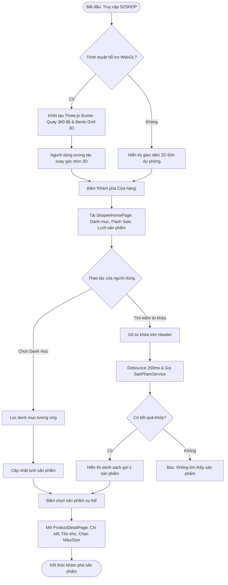
```mermaid
flowchart TD
    Start([Bắt đầu: Truy cập SZSHOP]) --> CheckWebGL{Trình duyệt hỗ trợ WebGL?}
    CheckWebGL -- Có --> Render3D[Khởi tạo Three.js Scene: Quay 360 độ & Bento Grid 3D]
    CheckWebGL -- Không --> Render2D[Hiển thị giao diện 2D tĩnh dự phòng]
    Render3D --> Interact3D[Người dùng tương tác xoay góc nhìn 3D]
    Render2D --> GoStore[Bấm 'Khám phá Cửa hàng']
    Interact3D --> GoStore
    GoStore --> LoadHome[Tải ShopeeHomePage: Danh mục, Flash Sale, Lưới sản phẩm]
    
    LoadHome --> UserAction{Thao tác của người dùng}
    UserAction -- Chọn Danh mục --> FilterCat[Lọc danh mục tương ứng] --> UpdateGrid[Cập nhật lưới sản phẩm]
    UserAction -- Tìm kiếm từ khóa --> InputSearch[Gõ từ khóa trên Header]
    InputSearch --> Debounce[Debounce 250ms & Gọi SanPhamService]
    Debounce --> HasResult{Có kết quả khớp?}
    HasResult -- Có --> ShowDropdown[Hiển thị danh sách gợi ý sản phẩm]
    HasResult -- Không --> ShowEmptySearch[Báo: Không tìm thấy sản phẩm]
    
    ShowDropdown --> SelectItem[Bấm chọn sản phẩm cụ thể]
    UpdateGrid --> SelectItem
    SelectItem --> ViewDetail[Mở ProductDetailPage: Chi tiết, Tồn kho, Chọn Màu/Size]
    ViewDetail --> End([Kết thúc khám phá sản phẩm])
```

#### Biểu đồ tuần tự (Sequence Diagram) - Tìm kiếm & Xem chi tiết sản phẩm
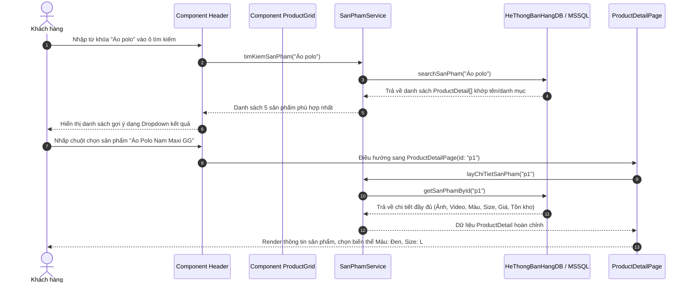
```mermaid
sequenceDiagram
    autonumber
    actor Customer as Khách hàng
    participant Header as Component Header
    participant ProductGrid as Component ProductGrid
    participant Service as SanPhamService
    participant DB as HeThongBanHangDB / MSSQL
    participant DetailPage as ProductDetailPage

    Customer->>Header: Nhập từ khóa "Áo polo" vào ô tìm kiếm
    Header->>Service: timKiemSanPham("Áo polo")
    Service->>DB: searchSanPham("Áo polo")
    DB-->>Service: Trả về danh sách ProductDetail[] khớp tên/danh mục
    Service-->>Header: Danh sách 5 sản phẩm phù hợp nhất
    Header-->>Customer: Hiển thị danh sách gợi ý dạng Dropdown kết quả
    Customer->>Header: Nhấp chuột chọn sản phẩm "Áo Polo Nam Maxi GG"
    Header->>DetailPage: Điều hướng sang ProductDetailPage(id: "p1")
    DetailPage->>Service: layChiTietSanPham("p1")
    Service->>DB: getSanPhamById("p1")
    DB-->>Service: Trả về chi tiết đầy đủ (Ảnh, Video, Màu, Size, Giá, Tồn kho)
    Service-->>DetailPage: Dữ liệu ProductDetail hoàn chỉnh
    DetailPage-->>Customer: Render thông tin sản phẩm, chọn biến thể Màu: Đen, Size: L
```

---

## 3.3 UC003_Quản lý Giỏ hàng Đa năng (Cart Management & MiniCart)

### 3.3.1 Mô tả use case UC003
- **Tên Use Case:** Quản lý Giỏ hàng Đa năng (Cart Management & Slide-over MiniCart).
- **Mã định danh:** `UC003`.
- **Tác nhân tham gia:** Khách vãng lai (Guest), Khách hàng (Customer).
- **Mục đích:** Cho phép người dùng thêm các sản phẩm với tùy chọn thuộc tính cụ thể vào giỏ hàng, xem nhanh nội dung giỏ hàng thông qua bảng trượt MiniCart từ cạnh phải màn hình, cập nhật tăng giảm số lượng, xóa sản phẩm không mong muốn và tự động cập nhật tổng tiền thanh toán tạm tính.
- **Tiền điều kiện:** Người dùng đang ở màn hình xem chi tiết sản phẩm (`ProductDetailPage`) hoặc bất kỳ trang nào có nút mở giỏ hàng trên Header.
- **Hậu điều kiện:** Trạng thái giỏ hàng (`cartItems`) được cập nhật trên giao diện và đồng bộ với dịch vụ lưu trữ (State & Backend DB).
- **Luồng sự kiện chính (Basic Flow):**
  1. Tại trang chi tiết sản phẩm, sau khi đã chọn Màu sắc và Kích thước mong muốn, người dùng nhấn nút "Thêm vào giỏ hàng".
  2. Hệ thống gọi hàm `handleAddToCart`:
     - Kiểm tra sản phẩm và biến thể đã có trong giỏ hàng hay chưa.
     - Nếu đã tồn tại: Tăng số lượng (`quantity = quantity + 1`).
     - Nếu chưa tồn tại: Tạo mới phần tử `CartItem` gồm `id`, `name`, `price`, `quantity`, `image`, `variant` (kết hợp Màu + Size).
  3. Badge số lượng trên biểu tượng Giỏ hàng ở Header lập tức tăng tương ứng.
  4. Hệ thống mở bảng trượt `MiniCart.tsx` từ cạnh phải màn hình (slide-over animation 300ms) kèm hiệu ứng backdrop mờ nền.
  5. Bảng MiniCart hiển thị:
     - Danh sách từng mặt hàng (Ảnh thu nhỏ, tên, biến thể size/màu, đơn giá, bộ nút tăng `+` / giảm `-` số lượng, icon nút xóa thùng rác).
     - Khu vực chân trang: Số tiền "Tạm tính" (Subtotal = Tổng của đơn giá x số lượng) và nút "Thanh toán ngay".
  6. Người dùng nhấn nút tăng `+` hoặc giảm `-` trên một mặt hàng:
     - Hệ thống gọi `updateCartQuantity(itemId, newQty)`.
     - Tự động kiểm tra số lượng tồn kho khả dụng tối đa.
     - Tính toán lại giá trị Tạm tính trong thời gian thực.
  7. Người dùng bấm "Thanh toán ngay", hệ thống đóng MiniCart và chuyển tiếp sang trang Xác nhận Đơn hàng (`OrderConfirmationPage.tsx`).
- **Các luồng thay thế & Luồng ngoại lệ:**
  - *Luồng thay thế 1 (Xóa mặt hàng):* Người dùng nhấn vào biểu tượng Thùng rác bên cạnh một sản phẩm trong MiniCart. Hệ thống gọi `removeFromCart(itemId)`, gỡ bỏ sản phẩm khỏi danh sách và cập nhật lại tổng tiền. Nếu giỏ hàng trống, MiniCart hiển thị hình ảnh giỏ hàng rỗng và nút "Tiếp tục mua sắm".
  - *Luồng ngoại lệ 1 (Thêm vượt quá số lượng tồn kho):* Nếu người dùng nhấn tăng số lượng vượt quá số lượng hàng có trong kho (`stock`), hệ thống vô hiệu hóa nút `+` và hiển thị thông báo nhỏ "Đã đạt giới hạn tồn kho của sản phẩm".

### 3.3.2 Biểu đồ UC003

#### Biểu đồ hoạt động (Activity Diagram) - Quản lý Giỏ hàng
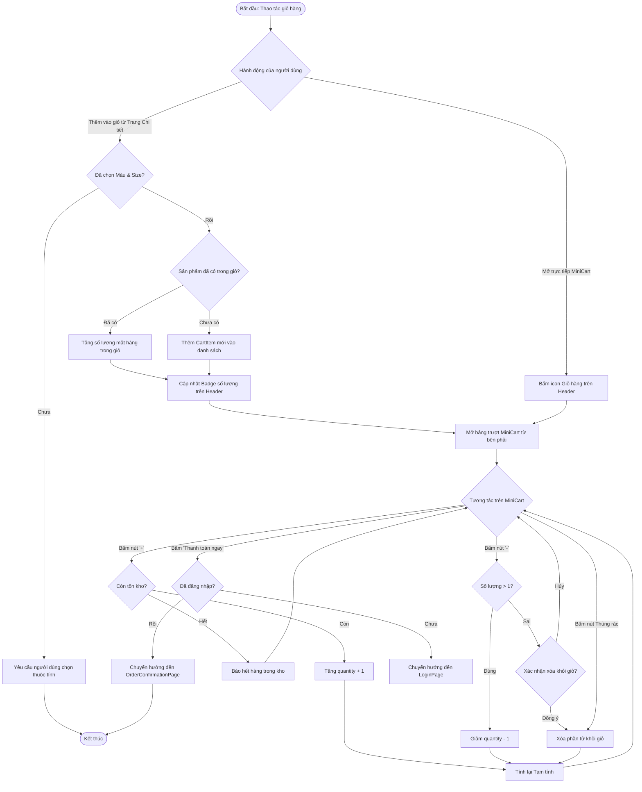
```mermaid
flowchart TD
    Start([Bắt đầu: Thao tác giỏ hàng]) --> Action{Hành động của người dùng}
    
    Action -- Thêm vào giỏ từ Trang Chi tiết --> CheckSelect{Đã chọn Màu & Size?}
    CheckSelect -- Chưa --> ShowAlert[Yêu cầu người dùng chọn thuộc tính] --> EndCart([Kết thúc])
    CheckSelect -- Rồi --> CheckExist{Sản phẩm đã có trong giỏ?}
    CheckExist -- Đã có --> IncQty[Tăng số lượng mặt hàng trong giỏ]
    CheckExist -- Chưa có --> AddNewItem[Thêm CartItem mới vào danh sách]
    IncQty --> UpdateBadge[Cập nhật Badge số lượng trên Header]
    AddNewItem --> UpdateBadge
    UpdateBadge --> OpenMiniCart[Mở bảng trượt MiniCart từ bên phải]
    
    Action -- Mở trực tiếp MiniCart --> ClickCartIcon[Bấm icon Giỏ hàng trên Header] --> OpenMiniCart
    
    OpenMiniCart --> MiniCartAction{Tương tác trên MiniCart}
    MiniCartAction -- Bấm nút '+' --> CheckStock{Còn tồn kho?}
    CheckStock -- Còn --> Add1[Tăng quantity + 1] --> Recalc[Tính lại Tạm tính]
    CheckStock -- Hết --> AlertMaxStock[Báo hết hàng trong kho] --> MiniCartAction
    
    MiniCartAction -- Bấm nút '-' --> CheckMinQty{Số lượng > 1?}
    CheckMinQty -- Đúng --> Sub1[Giảm quantity - 1] --> Recalc
    CheckMinQty -- Sai --> ConfirmDel{Xác nhận xóa khỏi giỏ?}
    ConfirmDel -- Đồng ý --> RemoveItem[Xóa phần tử khỏi giỏ] --> Recalc
    ConfirmDel -- Hủy --> MiniCartAction
    
    MiniCartAction -- Bấm nút Thùng rác --> RemoveItem
    Recalc --> MiniCartAction
    
    MiniCartAction -- Bấm 'Thanh toán ngay' --> CheckLoginCart{Đã đăng nhập?}
    CheckLoginCart -- Chưa --> RedirectLogin[Chuyển hướng đến LoginPage]
    CheckLoginCart -- Rồi --> GoCheckout[Chuyển hướng đến OrderConfirmationPage]
    GoCheckout --> EndCart
```

#### Biểu đồ tuần tự (Sequence Diagram) - Thao tác Thêm & Cập nhật Giỏ hàng
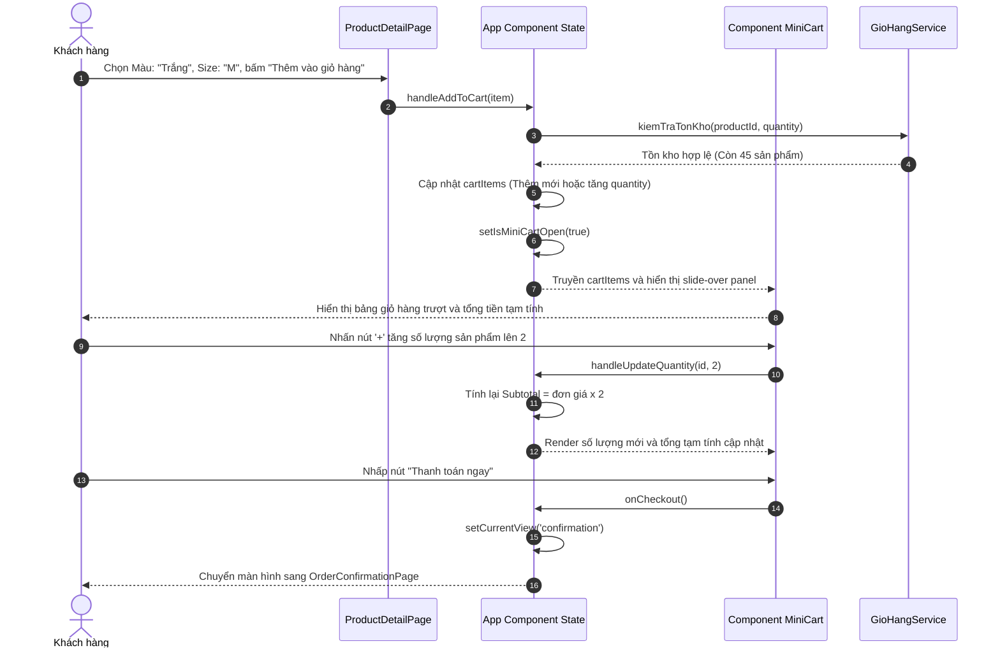
```mermaid
sequenceDiagram
    autonumber
    actor Customer as Khách hàng
    participant PDP as ProductDetailPage
    participant App as App Component State
    participant MiniCart as Component MiniCart
    participant Service as GioHangService

    Customer->>PDP: Chọn Màu: "Trắng", Size: "M", bấm "Thêm vào giỏ hàng"
    PDP->>App: handleAddToCart(item)
    App->>Service: kiemTraTonKho(productId, quantity)
    Service-->>App: Tồn kho hợp lệ (Còn 45 sản phẩm)
    App->>App: Cập nhật cartItems (Thêm mới hoặc tăng quantity)
    App->>App: setIsMiniCartOpen(true)
    App-->>MiniCart: Truyền cartItems và hiển thị slide-over panel
    MiniCart-->>Customer: Hiển thị bảng giỏ hàng trượt và tổng tiền tạm tính
    Customer->>MiniCart: Nhấn nút '+' tăng số lượng sản phẩm lên 2
    MiniCart->>App: handleUpdateQuantity(id, 2)
    App->>App: Tính lại Subtotal = đơn giá x 2
    App-->>MiniCart: Render số lượng mới và tổng tạm tính cập nhật
    Customer->>MiniCart: Nhấp nút "Thanh toán ngay"
    MiniCart->>App: onCheckout()
    App->>App: setCurrentView('confirmation')
    App-->>Customer: Chuyển màn hình sang OrderConfirmationPage
```

---

## 3.4 UC004_Xác nhận Đơn hàng & Thiết lập Giao nhận (Checkout)

### 3.4.1 Mô tả use case UC004
- **Tên Use Case:** Xác nhận Đơn hàng & Thiết lập Giao nhận (Order Confirmation & Checkout).
- **Mã định danh:** `UC004`.
- **Tác nhân tham gia:** Khách hàng (Customer).
- **Mục đích:** Cung cấp quy trình kiểm tra thông tin kiện hàng, nhập thông tin liên hệ và địa chỉ nhận hàng, chọn mã giảm giá ưu đãi (Voucher), tính toán chi phí vận chuyển, cam kết điều khoản mua hàng và khởi tạo đơn hàng chính thức trong hệ thống.
- **Tiền điều kiện:** Giỏ hàng của khách hàng có ít nhất 01 sản phẩm hợp lệ và khách hàng đã đăng nhập.
- **Hậu điều kiện:** Đơn hàng được tạo thành công với mã định danh duy nhất (ví dụ: `DH-20241228`) ở trạng thái `PENDING` trong cơ sở dữ liệu.
- **Luồng sự kiện chính (Basic Flow):**
  1. Người dùng bấm "Thanh toán ngay" từ giỏ hàng, hệ thống hiển thị `OrderConfirmationPage.tsx`.
  2. Màn hình chia làm 2 cột nghiệp vụ:
     - **Cột trái:** Form "Thông tin giao hàng" gồm các trường: Họ và tên người nhận, Số điện thoại, Địa chỉ nhận hàng chi tiết, Ghi chú đơn hàng. Kèm theo phần chọn "Mã giảm giá SZSHOP" (`AVAILABLE_COUPONS`).
     - **Cột phải:** "Tóm tắt đơn hàng" hiển thị danh sách các món hàng, Tạm tính, Phí vận chuyển tiêu chuẩn (30.000 đ), Số tiền giảm giá từ Coupon, và "TỔNG CỘNG" thanh toán cuối cùng.
  3. Người dùng nhập đầy đủ họ tên, số điện thoại và địa chỉ giao hàng.
  4. Người dùng bấm chọn mã khuyến mãi:
     - Mã `SZWELCOME`: Giảm 20.000 đ cho đơn hàng đầu tiên.
     - Mã `FREESHIP`: Miễn phí vận chuyển toàn quốc (tối đa 30.000 đ).
     - Mã `SALE50`: Giảm 50.000 đ cho các đơn hàng từ 1.000.000 đ trở lên.
  5. Hệ thống tính toán lại tổng tiền: `Tổng = Tạm tính + Phí ship - Giảm giá`.
  6. Người dùng tích chọn ô xác nhận: "Tôi đồng ý với điều khoản mua hàng của SZSHOP".
  7. Người dùng bấm nút "XÁC NHẬN ĐẶT HÀNG".
  8. Hệ thống gọi `DatHangService.taoDonHangNhap(cartItems, customerInfo)`:
     - Tạo bản ghi mới trong bảng `Orders` (trạng thái `Pending`).
     - Tạo các bản ghi chi tiết kiện hàng trong bảng `OrderItems`.
  9. Hệ thống chuyển tiếp người dùng sang trang Thanh toán Đa kênh `CheckoutPage.tsx`.
- **Các luồng thay thế & Luồng ngoại lệ:**
  - *Luồng ngoại lệ 1 (Bỏ trống thông tin giao hàng):* Nếu người dùng chưa điền đầy đủ Họ tên, Số điện thoại hoặc Địa chỉ, nút "Xác nhận đặt hàng" hiển thị thông báo yêu cầu bổ sung thông tin bắt buộc.
  - *Luồng ngoại lệ 2 (Áp dụng coupon không đủ điều kiện):* Nếu người dùng chọn mã `SALE50` khi tổng đơn hàng nhỏ hơn 1.000.000 đ, hệ thống cảnh báo: "Mã giảm giá chỉ áp dụng cho đơn hàng từ 1.000.000 đ" và không trừ tiền giảm giá.

### 3.4.2 Biểu đồ UC004

#### Biểu đồ hoạt động (Activity Diagram) - Xác nhận Đơn hàng
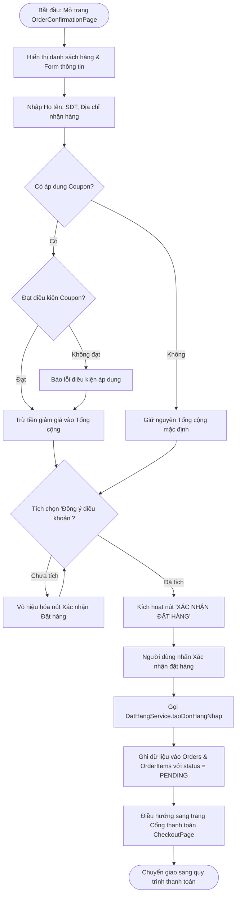
```mermaid
flowchart TD
    Start([Bắt đầu: Mở trang OrderConfirmationPage]) --> DisplayReview[Hiển thị danh sách hàng & Form thông tin]
    DisplayReview --> InputCustomer[Nhập Họ tên, SĐT, Địa chỉ nhận hàng]
    InputCustomer --> ChooseCoupon{Có áp dụng Coupon?}
    ChooseCoupon -- Có --> CheckCondition{Đạt điều kiện Coupon?}
    CheckCondition -- Đạt --> ApplyDiscount[Trừ tiền giảm giá vào Tổng cộng]
    CheckCondition -- Không đạt --> ShowCouponErr[Báo lỗi điều kiện áp dụng] --> ApplyDiscount
    ChooseCoupon -- Không --> KeepTotal[Giữ nguyên Tổng cộng mặc định]
    
    ApplyDiscount --> CheckAgree{Tích chọn 'Đồng ý điều khoản'?}
    KeepTotal --> CheckAgree
    CheckAgree -- Chưa tích --> DisableBtn[Vô hiệu hóa nút Xác nhận Đặt hàng] --> CheckAgree
    CheckAgree -- Đã tích --> EnableBtn[Kích hoạt nút 'XÁC NHẬN ĐẶT HÀNG']
    
    EnableBtn --> ClickConfirm[Người dùng nhấn Xác nhận đặt hàng]
    ClickConfirm --> CallService[Gọi DatHangService.taoDonHangNhap]
    CallService --> InsertDB[Ghi dữ liệu vào Orders & OrderItems với status = PENDING]
    InsertDB --> NavPayment[Điều hướng sang trang Cổng thanh toán CheckoutPage]
    NavPayment --> End([Chuyển giao sang quy trình thanh toán])
```

#### Biểu đồ tuần tự (Sequence Diagram) - Xác nhận Đơn hàng
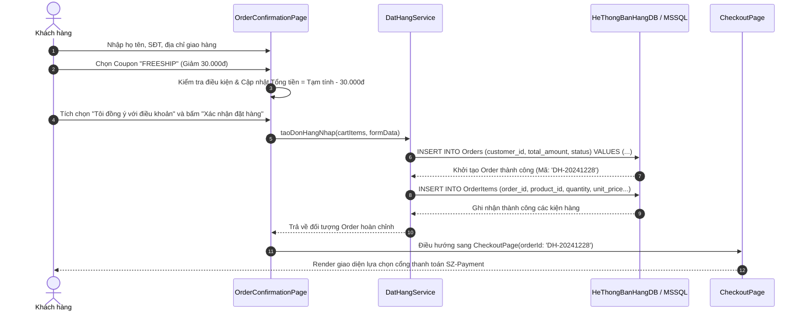
```mermaid
sequenceDiagram
    autonumber
    actor Customer as Khách hàng
    participant Page as OrderConfirmationPage
    participant Service as DatHangService
    participant DB as HeThongBanHangDB / MSSQL
    participant NextPage as CheckoutPage

    Customer->>Page: Nhập họ tên, SĐT, địa chỉ giao hàng
    Customer->>Page: Chọn Coupon "FREESHIP" (Giảm 30.000đ)
    Page->>Page: Kiểm tra điều kiện & Cập nhật Tổng tiền = Tạm tính - 30.000đ
    Customer->>Page: Tích chọn "Tôi đồng ý với điều khoản" và bấm "Xác nhận đặt hàng"
    Page->>Service: taoDonHangNhap(cartItems, formData)
    Service->>DB: INSERT INTO Orders (customer_id, total_amount, status) VALUES (...)
    DB-->>Service: Khởi tạo Order thành công (Mã: 'DH-20241228')
    Service->>DB: INSERT INTO OrderItems (order_id, product_id, quantity, unit_price...)
    DB-->>Service: Ghi nhận thành công các kiện hàng
    Service-->>Page: Trả về đối tượng Order hoàn chỉnh
    Page->>NextPage: Điều hướng sang CheckoutPage(orderId: 'DH-20241228')
    NextPage-->>Customer: Render giao diện lựa chọn cổng thanh toán SZ-Payment
```

---

## 3.5 UC005_Thanh toán Trực tuyến Đa kênh SZ-Payment Gateway

### 3.5.1 Mô tả use case UC005
- **Tên Use Case:** Thanh toán Trực tuyến Đa kênh SZ-Payment Gateway (Multi-Channel Payment Processing & Digital Receipt).
- **Mã định danh:** `UC005`.
- **Tác nhân tham gia:** Khách hàng (Customer), Cổng thanh toán bên thứ ba (VietQR/VNPAY/MoMo).
- **Mục đích:** Cung cấp giải pháp thanh toán điện tử an toàn, tiện lợi với đa dạng phương thức, tích hợp sinh mã QR động chuẩn quốc gia, đếm ngược thời gian phiên giao dịch 15 phút, xác thực trạng thái thanh toán và xuất hóa đơn điện tử 3D số kèm mã giao dịch `TRX`.
- **Tiền điều kiện:** Đơn hàng đã được khởi tạo ở trạng thái `PENDING` từ Use Case UC004.
- **Hậu điều kiện:** Đơn hàng được cập nhật trạng thái `PAID`, bản ghi thanh toán được lưu vết trong bảng `Payments`, và người dùng nhận được hóa đơn điện tử xác nhận.
- **Luồng sự kiện chính (Basic Flow - Quét mã VietQR/VNPAY):**
  1. Hệ thống hiển thị giao diện `CheckoutPage.tsx` gồm:
     - Tóm tắt đơn hàng và số tiền cần thanh toán.
     - Danh sách các phương thức thanh toán (`PaymentMethodList.tsx`):
       + 1. Quét mã VNPAY-QR (Khuyên dùng).
       + 2. Quét mã VietQR Napas 247.
       + 3. Thẻ ATM / Tài khoản ngân hàng nội địa.
       + 4. Thẻ tín dụng quốc tế (Visa, Mastercard, JCB).
       + 5. Ví điện tử MoMo.
       + 6. Thanh toán khi nhận hàng (COD).
  2. Người dùng chọn phương thức "Quét mã VNPAY-QR" hoặc "VietQR Napas 247".
  3. Người dùng nhấn nút "TIẾP TỤC THANH TOÁN".
  4. Hệ thống hiển thị bảng mã thanh toán số `QRCodePanel.tsx`:
     - Tự động sinh chuỗi mã hóa: `SZSHOP-PAYMENT-[MãĐơn]-[SốTiền]`.
     - Hiển thị hình ảnh mã QR động kèm logo đối tác bảo chứng.
     - Bắt đầu bộ đếm ngược thời gian hiệu lực 15:00 phút.
     - Hiển thị thông tin chuyển khoản: Tên chủ tài khoản, Số tài khoản, Ngân hàng thụ hưởng, Số tiền chính xác và Nội dung chuyển khoản (Mã đơn hàng).
     - Cung cấp nút tiện ích "Sao chép mã đơn" chỉ bằng 1 chạm.
  5. Người dùng mở ứng dụng Ngân hàng trên điện thoại (Mobile Banking) hoặc Ví điện tử, quét mã QR và xác nhận chuyển tiền.
  6. Cổng thanh toán gửi tín hiệu xác nhận thành công về Backend `POST /api/payment/confirm`.
  7. Backend cập nhật trạng thái đơn hàng trong bảng `Orders` sang `PAID` và ghi nhận một bản ghi vào bảng `Payments` (Mã giao dịch `TRX-99887766`, trạng thái `Success`).
  8. Frontend tự động điều hướng sang `TransactionResultPage.tsx`:
     - Kích hoạt hiệu ứng chúc mừng Confetti lung linh.
     - Hiển thị biểu tượng dấu tích xanh, thông báo: "Giao dịch thanh toán thành công!".
     - Hiển thị thẻ hóa đơn điện tử: Mã giao dịch ngân hàng, Ngày giờ thực hiện, Phương thức đã chọn, Số tiền đã trừ và Email nhận hóa đơn.
     - Cung cấp 2 nút hành động: "Xem chi tiết đơn hàng" và "Về trang chủ".
- **Các luồng thay thế & Luồng ngoại lệ:**
  - *Luồng thay thế 1 (Thanh toán khi nhận hàng COD):* Người dùng chọn phương thức COD. Hệ thống kiểm tra quy tắc nghiệp vụ: Nếu tổng giá trị đơn hàng > 5.000.000 đ, hệ thống vô hiệu hóa tùy chọn COD và hiển thị badge màu đỏ: "Không hỗ trợ COD cho đơn > 5 triệu nhằm đảm bảo an toàn vận chuyển". Nếu đơn hàng <= 5.000.000 đ, người dùng được chọn COD bình thường và đơn hàng chuyển thẳng sang trạng thái sẵn sàng giao.
  - *Luồng ngoại lệ 1 (Hết hạn phiên giao dịch mã QR):* Đồng hồ đếm ngược 15:00 chạm mốc 00:00. Mã QR bị làm mờ, xuất hiện lớp phủ cảnh báo "Mã thanh toán đã hết hạn" kèm nút "Tạo mã QR mới". Người dùng nhấn tạo mới để gia hạn thêm 15 phút.
  - *Luồng ngoại lệ 2 (Giao dịch thất bại / Khách hủy giao dịch):* Nếu người dùng bấm hủy hoặc ngân hàng từ chối giao dịch, hệ thống mở modal `PaymentFailedModal.tsx` giải thích nguyên nhân (Tài khoản không đủ số dư, vượt hạn mức ngày, lỗi mạng ngân hàng) kèm 2 lựa chọn: "Thử lại phương thức khác" hoặc "Liên hệ hỗ trợ 24/7".

### 3.5.2 Biểu đồ UC005

#### Biểu đồ hoạt động (Activity Diagram) - Thanh toán SZ-Payment
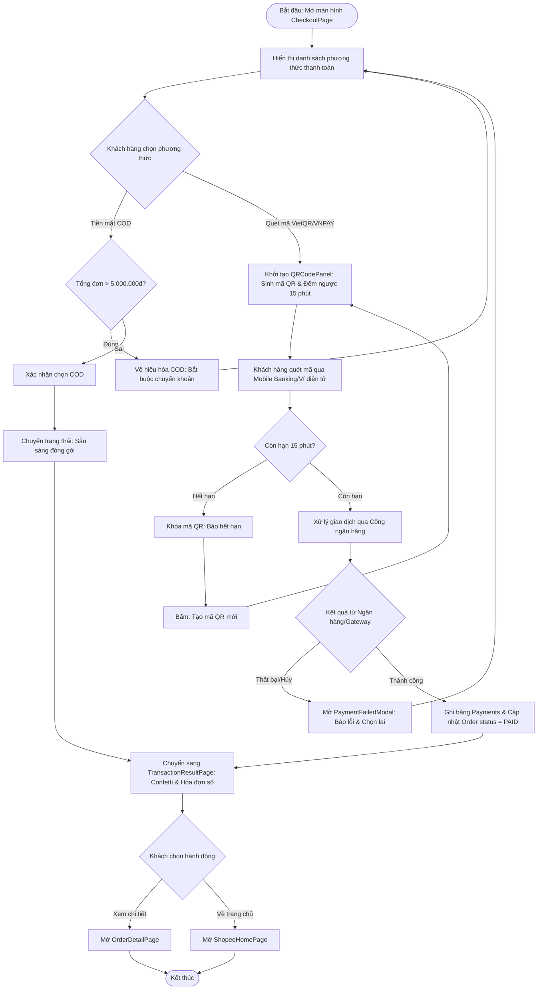
```mermaid
flowchart TD
    Start([Bắt đầu: Mở màn hình CheckoutPage]) --> ShowMethods[Hiển thị danh sách phương thức thanh toán]
    ShowMethods --> SelectMethod{Khách hàng chọn phương thức}
    
    %% Nhánh COD
    SelectMethod -- Tiền mặt COD --> CheckAmount{Tổng đơn > 5.000.000đ?}
    CheckAmount -- Đúng --> DisableCOD[Vô hiệu hóa COD: Bắt buộc chuyển khoản] --> ShowMethods
    CheckAmount -- Sai --> ConfirmCOD[Xác nhận chọn COD] --> CreateOrderDone[Chuyển trạng thái: Sẵn sàng đóng gói] --> SuccessPage
    
    %% Nhánh Quét mã QR (VietQR / VNPAY)
    SelectMethod -- Quét mã VietQR/VNPAY --> GenQR[Khởi tạo QRCodePanel: Sinh mã QR & Đếm ngược 15 phút]
    GenQR --> ScanQR[Khách hàng quét mã qua Mobile Banking/Ví điện tử]
    ScanQR --> TimerCheck{Còn hạn 15 phút?}
    TimerCheck -- Hết hạn --> ExpiredQR[Khóa mã QR: Báo hết hạn] --> RefreshQR[Bấm: Tạo mã QR mới] --> GenQR
    TimerCheck -- Còn hạn --> ProcessPayment[Xử lý giao dịch qua Cổng ngân hàng]
    
    ProcessPayment --> PayResult{Kết quả từ Ngân hàng/Gateway}
    PayResult -- Thất bại/Hủy --> ShowFailModal[Mở PaymentFailedModal: Báo lỗi & Chọn lại] --> ShowMethods
    PayResult -- Thành công --> RecordPayment[Ghi bảng Payments & Cập nhật Order status = PAID]
    
    RecordPayment --> SuccessPage[Chuyển sang TransactionResultPage: Confetti & Hóa đơn số]
    SuccessPage --> ViewDetailChoice{Khách chọn hành động}
    ViewDetailChoice -- Xem chi tiết --> NavDetail[Mở OrderDetailPage] --> End([Kết thúc])
    ViewDetailChoice -- Về trang chủ --> NavHome[Mở ShopeeHomePage] --> End
```

#### Biểu đồ tuần tự (Sequence Diagram) - Thanh toán qua mã QR Cổng SZ-Payment
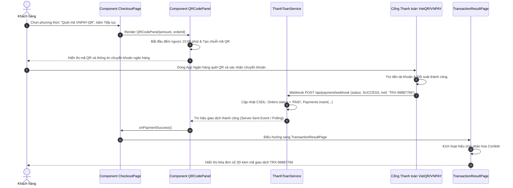
```mermaid
sequenceDiagram
    autonumber
    actor Customer as Khách hàng
    participant Checkout as Component CheckoutPage
    participant QRPanel as Component QRCodePanel
    participant Service as ThanhToanService
    participant Gateway as Cổng Thanh toán VietQR/VNPAY
    participant ResultPage as TransactionResultPage

    Customer->>Checkout: Chọn phương thức "Quét mã VNPAY-QR", bấm Tiếp tục
    Checkout->>QRPanel: Render QRCodePanel(amount, orderId)
    QRPanel->>QRPanel: Bắt đầu đếm ngược 15:00 phút & Tạo chuỗi mã QR
    QRPanel-->>Customer: Hiển thị mã QR và thông tin chuyển khoản ngân hàng
    Customer->>Gateway: Dùng App Ngân hàng quét QR và xác nhận chuyển khoản
    Gateway->>Gateway: Trừ tiền tài khoản & Đối soát thành công
    Gateway->>Service: Webhook POST /api/payment/webhook (status: SUCCESS, txId: 'TRX-99887766')
    Service->>Service: Cập nhật CSDL: Orders.status = 'PAID', Payments.insert(...)
    Service-->>QRPanel: Tín hiệu giao dịch thành công (Server-Sent Event / Polling)
    QRPanel->>Checkout: onPaymentSuccess()
    Checkout->>ResultPage: Điều hướng sang TransactionResultPage
    ResultPage->>ResultPage: Kích hoạt hiệu ứng pháo hoa Confetti
    ResultPage-->>Customer: Hiển thị Hóa đơn số 3D kèm mã giao dịch TRX-99887766
```

---

## 3.6 UC006_Tra cứu Tiến trình Vận đơn & Quản lý Đơn hàng

### 3.6.1 Mô tả use case UC006
- **Tên Use Case:** Tra cứu Tiến trình Vận đơn & Quản lý Đơn hàng (Order Tracking & Logistics Lifecycle).
- **Mã định danh:** `UC006`.
- **Tác nhân tham gia:** Khách vãng lai (Guest), Khách hàng (Customer).
- **Mục đích:** Cho phép người dùng theo dõi vòng đời vận chuyển của kiện hàng theo thời gian thực thông qua mã đơn hàng, xem chi tiết lịch sử mốc giao nhận và thực hiện hủy đơn hàng đối với các kiện chưa bàn giao vận chuyển.
- **Tiền điều kiện:** Người dùng có mã đơn hàng hợp lệ (ví dụ: `DH-20241228-01`).
- **Hậu điều kiện:** Hệ thống cung cấp lộ trình di chuyển của kiện hàng hoặc ghi nhận trạng thái hủy đơn.
- **Luồng sự kiện chính (Basic Flow):**
  1. Người dùng truy cập trang `OrderTrackingPage.tsx` từ menu Header hoặc đường dẫn trực tiếp.
  2. Người dùng nhập mã đơn hàng vào ô tìm kiếm và bấm biểu tượng Kính lúp.
  3. Hệ thống gọi `DatHangService.traCuuDonHang(orderId)`.
  4. Hệ thống trả về mảng các bước vận đơn (`TrackingStep[]`) và hiển thị dòng thời gian (Vertical Timeline) gồm 5 trạng thái tiêu chuẩn:
     - **Mốc 1 - Chờ xác nhận (Pending):** Đơn hàng đã được ghi nhận trên hệ thống sàn.
     - **Mốc 2 - Đã thanh toán (Paid):** Giao dịch tài chính đã được cổng thanh toán đối soát hoàn tất.
     - **Mốc 3 - Đang chuẩn bị hàng (Processing):** Người bán đang đóng gói kiện hàng.
     - **Mốc 4 - Đang vận chuyển (Shipping):** Kiện hàng đã được bàn giao cho đơn vị bưu chính chuyển phát nhanh.
     - **Mốc 5 - Đã giao hàng (Delivered):** Người mua đã nhận hàng và ký nhận thành công.
  5. Các mốc đã hoàn thành được đánh dấu bằng icon màu xanh lá cây (`CheckCircle`), mốc đang thực hiện hiển thị icon động, và mốc tương lai hiển thị màu xám.
- **Các luồng thay thế & Luồng ngoại lệ:**
  - *Luồng thay thế 1 (Yêu cầu hủy đơn hàng):* Nếu đơn hàng đang ở mốc "Chờ xác nhận" hoặc "Đã thanh toán" (chưa chuyển sang "Đang vận chuyển"), hệ thống hiển thị nút "Hủy đơn hàng". Khi người dùng bấm nút và xác nhận hộp thoại thông báo, hệ thống cập nhật trạng thái đơn sang `CANCELLED` và kích hoạt luồng hoàn tiền về ví/tài khoản thanh toán trong 24 giờ.
  - *Luồng ngoại lệ 1 (Mã đơn hàng không tồn tại):* Nếu mã đơn nhập không tìm thấy trong hệ thống, giao diện hiển thị thông báo lỗi: "Không tìm thấy thông tin đơn hàng này. Vui lòng kiểm tra lại mã vận đơn."

### 3.6.2 Biểu đồ UC006

#### Biểu đồ hoạt động (Activity Diagram) - Tra cứu đơn hàng
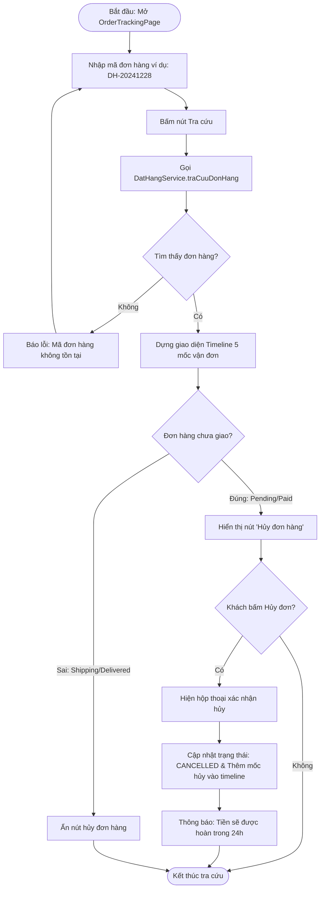
```mermaid
flowchart TD
    Start([Bắt đầu: Mở OrderTrackingPage]) --> InputOrderId[Nhập mã đơn hàng ví dụ: DH-20241228]
    InputOrderId --> ClickSearch[Bấm nút Tra cứu]
    ClickSearch --> QueryDB[Gọi DatHangService.traCuuDonHang]
    QueryDB --> CheckExist{Tìm thấy đơn hàng?}
    CheckExist -- Không --> ShowNotFound[Báo lỗi: Mã đơn hàng không tồn tại] --> InputOrderId
    CheckExist -- Có --> RenderTimeline[Dựng giao diện Timeline 5 mốc vận đơn]
    
    RenderTimeline --> CheckCancelable{Đơn hàng chưa giao?}
    CheckCancelable -- Đúng: Pending/Paid --> ShowCancelBtn[Hiển thị nút 'Hủy đơn hàng']
    CheckCancelable -- Sai: Shipping/Delivered --> HideCancelBtn[Ẩn nút hủy đơn hàng]
    
    ShowCancelBtn --> UserCancelChoice{Khách bấm Hủy đơn?}
    UserCancelChoice -- Không --> End([Kết thúc tra cứu])
    UserCancelChoice -- Có --> ConfirmModal[Hiện hộp thoại xác nhận hủy]
    ConfirmModal --> UpdateCancel[Cập nhật trạng thái: CANCELLED & Thêm mốc hủy vào timeline]
    UpdateCancel --> AlertRefund[Thông báo: Tiền sẽ được hoàn trong 24h] --> End
    HideCancelBtn --> End
```

#### Biểu đồ tuần tự (Sequence Diagram) - Tra cứu tiến trình đơn hàng
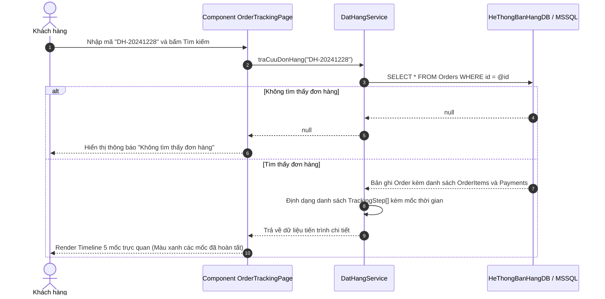
```mermaid
sequenceDiagram
    autonumber
    actor Customer as Khách hàng
    participant UI as Component OrderTrackingPage
    participant Service as DatHangService
    participant DB as HeThongBanHangDB / MSSQL

    Customer->>UI: Nhập mã "DH-20241228" và bấm Tìm kiếm
    UI->>Service: traCuuDonHang("DH-20241228")
    Service->>DB: SELECT * FROM Orders WHERE id = @id
    alt Không tìm thấy đơn hàng
        DB-->>Service: null
        Service-->>UI: null
        UI-->>Customer: Hiển thị thông báo "Không tìm thấy đơn hàng"
    else Tìm thấy đơn hàng
        DB-->>Service: Bản ghi Order kèm danh sách OrderItems và Payments
        Service->>Service: Định dạng danh sách TrackingStep[] kèm mốc thời gian
        Service-->>UI: Trả về dữ liệu tiến trình chi tiết
        UI-->>Customer: Render Timeline 5 mốc trực quan (Màu xanh các mốc đã hoàn tất)
    end
```

---

## 3.7 UC007_Trợ lý AI Mua sắm & Phân tích Doanh số ZShop Copilot

### 3.7.1 Mô tả use case UC007
- **Tên Use Case:** Trợ lý AI Mua sắm & Phân tích Doanh số ZShop Copilot (RAG-Driven Intelligent Sales & Analytics Copilot).
- **Mã định danh:** `UC007`.
- **Tác nhân tham gia:** Khách vãng lai (Guest), Khách hàng (Customer), Nhà bán lẻ (Seller), Quản trị viên (Admin), Dịch vụ ngoài (Gemini LLM).
- **Mục đích:** Cung cấp trợ lý trí tuệ nhân tạo thông minh tương tác bằng ngôn ngữ tự nhiên tiếng Việt, vận hành bằng kiến trúc RAG (Retrieval-Augmented Generation) kết hợp 6 Business Skills nghiệp vụ giúp giải quyết tự động các bài toán mua sắm, quản trị bán hàng và phân tích dữ liệu.
- **Tiền điều kiện:** Người dùng bấm vào biểu tượng bong bóng Chatbot AI ở góc phải phía dưới màn hình (`ChatBot.tsx`).
- **Hậu điều kiện:** Người dùng nhận được phản hồi tư vấn chính xác, tương tác trực tiếp với các thẻ sản phẩm hành động (Actionable Cards) được sinh động trong khung chat.
- **Luồng 6 Kỹ năng Nghiệp vụ AI (6 AI Business Skills):**
  1. **Skill 1 - Tư vấn theo ngân sách (Budget Recommender):** Người dùng nhập: "Tôi có khoảng 500k, tư vấn cho tôi một chiếc áo đẹp". AI phân tích intent trích xuất ngân sách `<= 500.000 đ`, truy vấn CSDL danh mục Áo và hiển thị danh sách các mẫu áo phù hợp nhất kèm nút "Mua ngay".
  2. **Skill 2 - Lọc sản phẩm theo danh mục (Category Filtering):** Người dùng yêu cầu: "Tìm cho tôi giày thể thao sneaker nam". AI tự động ánh xạ sang danh mục `Giày dép`, trả về danh sách sản phẩm kèm điểm đánh giá sao và giá thành.
  3. **Skill 3 - Thêm nhanh vào giỏ hàng (Quick Add-to-Cart):** Người dùng bấm trực tiếp vào nút "Thêm vào giỏ" gắn liền trên thẻ sản phẩm mà AI vừa tư vấn ngay trong cửa sổ chat, sản phẩm lập tức được nạp vào giỏ hàng mà không cần chuyển trang.
  4. **Skill 4 - Tra cứu đơn hàng tức thì (Instant Order Tracking):** Người dùng nhắn: "Kiểm tra đơn hàng DH-20241228 giúp tôi". AI gọi `DatHangService` trích xuất trạng thái đơn hàng và phản hồi vắn tắt lộ trình hiện tại của kiện hàng.
  5. **Skill 5 - Báo cáo doanh thu cho Admin (Admin Sales Intelligence):** Khi người dùng là Admin chat: "Báo cáo doanh số hôm nay", AI kiểm tra phân quyền `userRole === 'ADMIN'`, tổng hợp doanh thu theo ngày từ CSDL và xuất báo cáo tài chính trực quan.
  6. **Skill 6 - AI Copywriter cho Seller (SEO Product Copywriting):** Nhà bán lẻ yêu cầu: "Viết mô tả sản phẩm cho Áo khoác Bomber phong cách đường phố". AI tự động tạo bài viết giới thiệu chuẩn SEO gồm tiêu đề hấp dẫn, đặc tính kỹ thuật, chất liệu vải và hashtag xu hướng.
- **Luồng sự kiện chính (Basic Flow):**
  1. Người dùng mở khung chat AI Copilot và nhập câu hỏi bằng tiếng Việt tự nhiên.
  2. Frontend gửi tin nhắn đến `szshop-backend/controllers/ChatController.js`.
  3. Backend chuyển tiếp câu hỏi qua `AiService.js`:
     - Tầng RAG Context Builder thu thập dữ liệu bảng `Products`, `Orders` có cấu trúc từ SQL Server.
     - Ghép nối dữ liệu ngữ cảnh vào RAG Prompt.
     - Gọi Google Gemini API bằng giao thức streaming/json.
  4. Gemini trả về câu trả lời tự nhiên kèm danh sách mã ID sản phẩm đề xuất (Metadata).
  5. Frontend hiển thị nội dung câu trả lời và tự động render các thẻ sản phẩm tương tác bên dưới bong bóng chat.
- **Các luồng thay thế & Luồng ngoại lệ:**
  - *Luồng ngoại lệ 1 (Mất kết nối API Gemini):* Nếu Gemini API bị nghẽn mạng hoặc vượt hạn ngạch (Rate Limit), hệ thống kích hoạt bộ dự phòng cục bộ `Local Rule-based Intent Engine` trong `ChatBot.tsx` phân tích từ khóa theo biểu thức chính quy (Regex) và trả lời chuẩn xác theo các mẫu kịch bản có sẵn.

### 3.7.2 Biểu đồ UC007

#### Biểu đồ hoạt động (Activity Diagram) - Tương tác Trợ lý AI Copilot
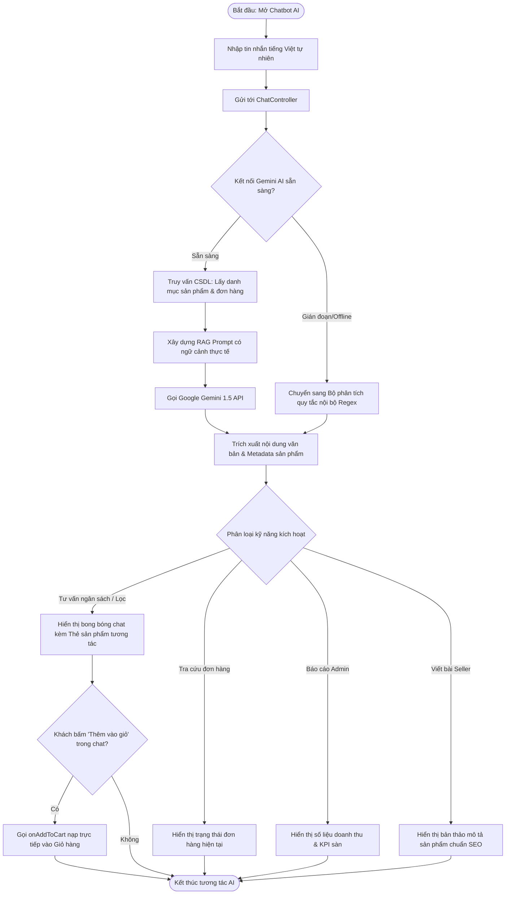
```mermaid
flowchart TD
    Start([Bắt đầu: Mở Chatbot AI]) --> UserMsg[Nhập tin nhắn tiếng Việt tự nhiên]
    UserMsg --> SendChatReq[Gửi tới ChatController]
    SendChatReq --> CheckAIOnline{Kết nối Gemini AI sẵn sàng?}
    
    CheckAIOnline -- Sẵn sàng --> RAGContext[Truy vấn CSDL: Lấy danh mục sản phẩm & đơn hàng]
    RAGContext --> BuildPrompt[Xây dựng RAG Prompt có ngữ cảnh thực tế]
    BuildPrompt --> CallGemini[Gọi Google Gemini 1.5 API]
    CallGemini --> ParseResponse[Trích xuất nội dung văn bản & Metadata sản phẩm]
    
    CheckAIOnline -- Gián đoạn/Offline --> LocalEngine[Chuyển sang Bộ phân tích quy tắc nội bộ Regex]
    LocalEngine --> ParseResponse
    
    ParseResponse --> SkillDispatch{Phân loại kỹ năng kích hoạt}
    SkillDispatch -- Tư vấn ngân sách / Lọc --> ShowProductCards[Hiển thị bong bóng chat kèm Thẻ sản phẩm tương tác]
    SkillDispatch -- Tra cứu đơn hàng --> ShowOrderStatus[Hiển thị trạng thái đơn hàng hiện tại]
    SkillDispatch -- Báo cáo Admin --> ShowReport[Hiển thị số liệu doanh thu & KPI sàn]
    SkillDispatch -- Viết bài Seller --> ShowSEOText[Hiển thị bản thảo mô tả sản phẩm chuẩn SEO]
    
    ShowProductCards --> QuickCartAction{Khách bấm 'Thêm vào giỏ' trong chat?}
    QuickCartAction -- Có --> AddDirect[Gọi onAddToCart nạp trực tiếp vào Giỏ hàng] --> End([Kết thúc tương tác AI])
    QuickCartAction -- Không --> End
    ShowOrderStatus --> End
    ShowReport --> End
    ShowSEOText --> End
```

#### Biểu đồ tuần tự (Sequence Diagram) - Luồng xử lý AI RAG Copilot
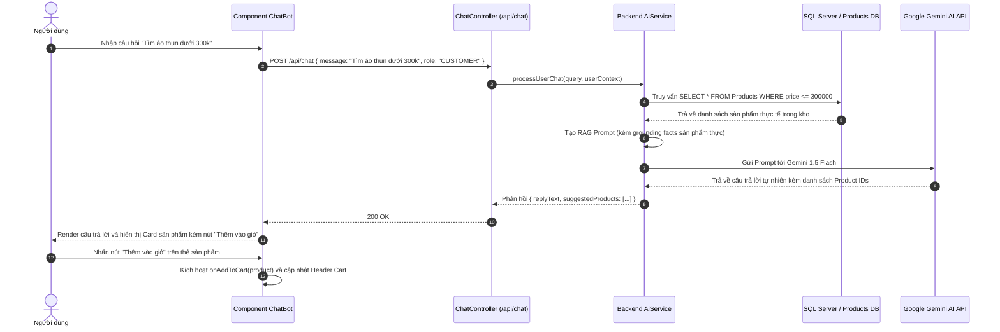
```mermaid
sequenceDiagram
    autonumber
    actor User as Người dùng
    participant ChatUI as Component ChatBot
    participant Controller as ChatController (/api/chat)
    participant AIService as Backend AiService
    participant DB as SQL Server / Products DB
    participant Gemini as Google Gemini AI API

    User->>ChatUI: Nhập câu hỏi "Tìm áo thun dưới 300k"
    ChatUI->>Controller: POST /api/chat { message: "Tìm áo thun dưới 300k", role: "CUSTOMER" }
    Controller->>AIService: processUserChat(query, userContext)
    AIService->>DB: Truy vấn SELECT * FROM Products WHERE price <= 300000
    DB-->>AIService: Trả về danh sách sản phẩm thực tế trong kho
    AIService->>AIService: Tạo RAG Prompt (kèm grounding facts sản phẩm thực)
    AIService->>Gemini: Gửi Prompt tới Gemini 1.5 Flash
    Gemini-->>AIService: Trả về câu trả lời tự nhiên kèm danh sách Product IDs
    AIService-->>Controller: Phản hồi { replyText, suggestedProducts: [...] }
    Controller-->>ChatUI: 200 OK
    ChatUI-->>User: Render câu trả lời và hiển thị Card sản phẩm kèm nút "Thêm vào giỏ"
    User->>ChatUI: Nhấn nút "Thêm vào giỏ" trên thẻ sản phẩm
    ChatUI->>ChatUI: Kích hoạt onAddToCart(product) và cập nhật Header Cart
```

---

## 3.8 UC008_Quản lý Kênh Nhà bán lẻ (Seller Channel)

### 3.8.1 Mô tả use case UC008
- **Tên Use Case:** Quản lý Kênh Nhà bán lẻ (Seller Channel & Inventory Management).
- **Mã định danh:** `UC008`.
- **Tác nhân tham gia:** Nhà bán lẻ (Seller), Khách hàng (Customer).
- **Mục đích:** Cho phép các chủ shop đăng ký gian hàng kinh doanh trên sàn, thiết lập thông tin hồ sơ cửa hàng, đăng tải sản phẩm mới kèm giá và số lượng tồn kho, chỉnh sửa và quản lý vòng đời hàng hóa, theo dõi các đơn hàng được đặt và kiểm tra số dư ví người bán.
- **Tiền điều kiện:** Người dùng đã đăng nhập và truy cập vào `SellerChannelPage.tsx`.
- **Hậu điều kiện:** Sản phẩm mới hoặc thông tin cập nhật được lưu trữ bền vững trong cơ sở dữ liệu và hiển thị trên sàn thương mại điện tử.
- **Luồng sự kiện chính (Basic Flow):**
  1. Người dùng chọn menu "Kênh Người Bán" trên thanh Header.
  2. Nếu tài khoản chưa phải là Seller: Hệ thống hiển thị tab "Đăng ký mở gian hàng" (`profile`), cho phép điền Tên cửa hàng, Mô tả, Số điện thoại, Địa chỉ kho hàng và gửi yêu cầu phê duyệt tới Admin.
  3. Khi tài khoản đã được phê duyệt làm Seller, giao diện hiển thị 4 tab quản trị:
     - **Tổng quan (Overview):** Hiển thị các chỉ số nhanh gồm Tổng doanh thu bán hàng, Số đơn hàng mới, Số sản phẩm đang bày bán và Số dư ví tiền (`wallet_balance`).
     - **Quản lý sản phẩm (Products):** Danh sách toàn bộ sản phẩm của Shop kèm hình ảnh, đơn giá, số lượng tồn kho, nút "Chỉnh sửa" và "Xóa".
     - **Đơn hàng (Orders):** Danh sách các kiện hàng do khách đặt mua từ shop, kèm trạng thái vận chuyển.
     - **Hồ sơ shop (Profile):** Cập nhật logo, tên shop và thông tin liên hệ.
  4. Người dùng bấm nút "+ Thêm sản phẩm mới" tại tab Sản phẩm.
  5. Modal nhập liệu xuất hiện: Người dùng nhập Tên sản phẩm, Đơn giá, Số lượng tồn kho ban đầu, Chọn danh mục (Thời trang, Giày dép, Phụ kiện), và Tải lên URL ảnh sản phẩm.
  6. Người dùng nhấn nút "Lưu sản phẩm".
  7. Hệ thống gọi API `POST /api/products` để ghi bản ghi mới vào bảng `Products` (với `seller_id` của shop). Danh sách sản phẩm của shop lập tức được làm mới.
- **Các luồng thay thế & Luồng ngoại lệ:**
  - *Luồng thay thế 1 (Chỉnh sửa / Xóa sản phẩm):* Tại danh sách sản phẩm, Seller bấm nút "Sửa" để thay đổi giá hoặc số lượng tồn kho; bấm nút "Xóa" kèm xác nhận để xóa sản phẩm khỏi kho hàng.
  - *Luồng ngoại lệ 1 (Shop chưa được duyệt):* Nếu Seller gửi hồ sơ nhưng Admin chưa phê duyệt, giao diện hiển thị trạng thái "Đang chờ Admin phê duyệt hồ sơ" và tạm thời khóa tính năng đăng bán sản phẩm.

### 3.8.2 Biểu đồ UC008

#### Biểu đồ hoạt động (Activity Diagram) - Quản lý Kênh Người bán
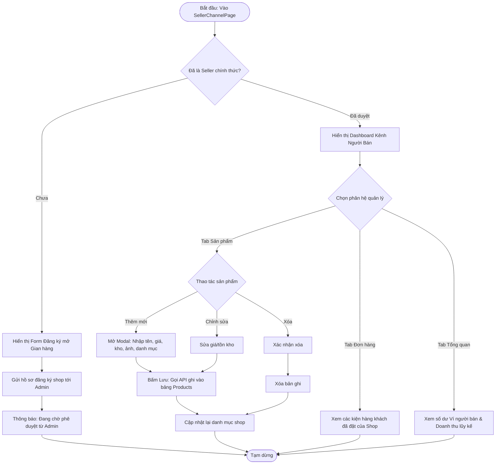
```mermaid
flowchart TD
    Start([Bắt đầu: Vào SellerChannelPage]) --> CheckRole{Đã là Seller chính thức?}
    CheckRole -- Chưa --> ShowRegForm[Hiển thị Form Đăng ký mở Gian hàng]
    ShowRegForm --> SubmitReg[Gửi hồ sơ đăng ký shop tới Admin]
    SubmitReg --> PendingNotice[Thông báo: Đang chờ phê duyệt từ Admin] --> End([Tạm dừng])
    
    CheckRole -- Đã duyệt --> ShowDashboard[Hiển thị Dashboard Kênh Người Bán]
    ShowDashboard --> SelectTab{Chọn phân hệ quản lý}
    
    SelectTab -- Tab Sản phẩm --> ProductAction{Thao tác sản phẩm}
    ProductAction -- Thêm mới --> OpenModal[Mở Modal: Nhập tên, giá, kho, ảnh, danh mục]
    OpenModal --> SaveProduct[Bấm Lưu: Gọi API ghi vào bảng Products] --> RefreshList[Cập nhật lại danh mục shop]
    ProductAction -- Chỉnh sửa --> EditModal[Sửa giá/tồn kho] --> SaveProduct
    ProductAction -- Xóa --> ConfirmDel[Xác nhận xóa] --> DeleteDB[Xóa bản ghi] --> RefreshList
    
    SelectTab -- Tab Đơn hàng --> ViewShopOrders[Xem các kiện hàng khách đã đặt của Shop]
    SelectTab -- Tab Tổng quan --> ViewWallet[Xem số dư Ví người bán & Doanh thu lũy kế]
    
    RefreshList --> End
    ViewShopOrders --> End
    ViewWallet --> End
```

#### Biểu đồ tuần tự (Sequence Diagram) - Đăng bán sản phẩm mới của Seller
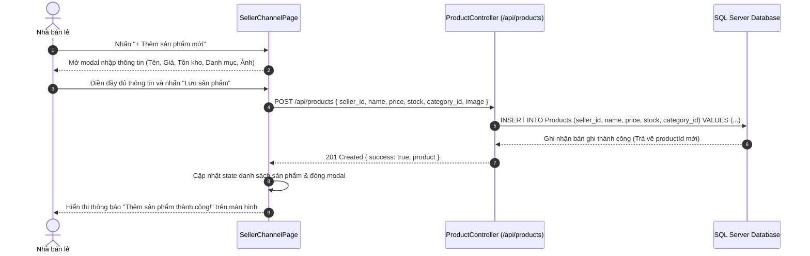
```mermaid
sequenceDiagram
    autonumber
    actor Seller as Nhà bán lẻ
    participant UI as SellerChannelPage
    participant Controller as ProductController (/api/products)
    participant DB as SQL Server Database

    Seller->>UI: Nhấn "+ Thêm sản phẩm mới"
    UI-->>Seller: Mở modal nhập thông tin (Tên, Giá, Tồn kho, Danh mục, Ảnh)
    Seller->>UI: Điền đầy đủ thông tin và nhấn "Lưu sản phẩm"
    UI->>Controller: POST /api/products { seller_id, name, price, stock, category_id, image }
    Controller->>DB: INSERT INTO Products (seller_id, name, price, stock, category_id) VALUES (...)
    DB-->>Controller: Ghi nhận bản ghi thành công (Trả về productId mới)
    Controller-->>UI: 201 Created { success: true, product }
    UI->>UI: Cập nhật state danh sách sản phẩm & đóng modal
    UI-->>Seller: Hiển thị thông báo "Thêm sản phẩm thành công!" trên màn hình
```

---

## 3.9 UC009_Quản trị Sàn E-Commerce (Admin Dashboard)

### 3.9.1 Mô tả use case UC009
- **Tên Use Case:** Quản trị Sàn E-Commerce (Admin Dashboard & Store Governance).
- **Mã định danh:** `UC009`.
- **Tác nhân tham gia:** Quản trị viên (Admin).
- **Mục đích:** Cung cấp trung tâm điều hành toàn diện cho Quản trị viên sàn để theo dõi chỉ số hiệu suất kinh doanh (KPI, doanh thu tuần/tháng, tổng đơn hàng, người dùng mới), phê duyệt hồ sơ người bán, kiểm duyệt sản phẩm toàn sàn và phân tích tài chính.
- **Tiền điều kiện:** Người dùng đã đăng nhập với vai trò `ADMIN` (`userRole === 'ADMIN'`).
- **Hậu điều kiện:** Các thao tác phê duyệt, cập nhật hoặc xóa dữ liệu được áp dụng tức thì trên toàn bộ hệ thống.
- **Luồng sự kiện chính (Basic Flow):**
  1. Admin đăng nhập vào hệ thống và được điều hướng tới `AdminDashboard.tsx`.
  2. Hệ thống tải dữ liệu tổng thể và hiển thị các khối KPI chính:
     - **Thẻ Doanh thu tổng:** Tổng doanh thu toàn sàn đạt được.
     - **Thẻ Đơn hàng:** Tổng số đơn hàng phát sinh kèm phân loại trạng thái (Đã thanh toán, Đang vận chuyển, Hoàn tất, Đã hủy).
     - **Thẻ Tăng trưởng:** Tỷ lệ tăng trưởng người dùng mới.
     - **Biểu đồ cột Doanh thu tuần:** Thể hiện trực quan doanh số từ Thứ 2 đến Chủ nhật.
  3. Admin chọn tab "Phê duyệt Người bán" (`Sellers`):
     - Hiển thị danh sách các hồ sơ đăng ký mở gian hàng đang chờ duyệt.
     - Admin xem xét thông tin shop và bấm nút "Phê duyệt" hoặc "Từ chối".
     - Khi bấm "Phê duyệt", hệ thống cập nhật trạng thái `APPROVED` cho Shop trong bảng `Sellers` và cấp quyền bán hàng cho tài khoản tương ứng.
  4. Admin chọn tab "Quản lý Sản phẩm toàn sàn" (`Products`):
     - Xem toàn bộ danh mục sản phẩm của tất cả các nhà bán lẻ.
     - Cho phép Admin lọc theo ngành hàng, sửa thông tin kiểm duyệt hoặc gỡ bỏ các sản phẩm vi phạm chính sách sàn.
  5. Admin chọn tab "Quản lý Đơn hàng" (`Orders`):
     - Xem danh sách toàn bộ các giao dịch thanh toán và đơn hàng phát sinh trên toàn hệ thống.
- **Các luồng thay thế & Luồng ngoại lệ:**
  - *Luồng ngoại lệ 1 (Truy cập trái phép):* Nếu một người dùng có vai trò `CUSTOMER` hoặc `GUEST` cố tình truy cập vào đường dẫn Admin, hệ thống tự động chặn và hiển thị màn hình từ chối quyền truy cập (Access Denied / 403 Forbidden).

### 3.9.2 Biểu đồ UC009

#### Biểu đồ hoạt động (Activity Diagram) - Quản trị Hệ thống Sàn
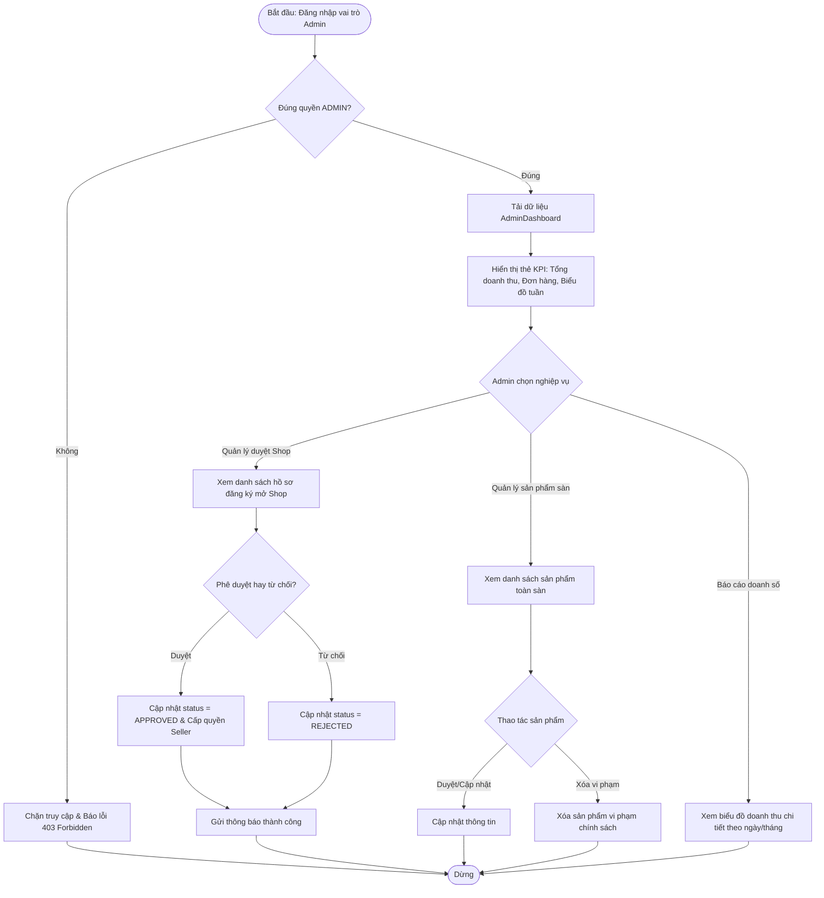
```mermaid
flowchart TD
    Start([Bắt đầu: Đăng nhập vai trò Admin]) --> CheckAdminAuth{Đúng quyền ADMIN?}
    CheckAdminAuth -- Không --> BlockAccess[Chặn truy cập & Báo lỗi 403 Forbidden] --> End([Dừng])
    CheckAdminAuth -- Đúng --> LoadDashboard[Tải dữ liệu AdminDashboard]
    
    LoadDashboard --> RenderKPI[Hiển thị thẻ KPI: Tổng doanh thu, Đơn hàng, Biểu đồ tuần]
    RenderKPI --> AdminChoice{Admin chọn nghiệp vụ}
    
    AdminChoice -- Quản lý duyệt Shop --> ViewPendingSellers[Xem danh sách hồ sơ đăng ký mở Shop]
    ViewPendingSellers --> SellerDecision{Phê duyệt hay từ chối?}
    SellerDecision -- Duyệt --> ApproveShop[Cập nhật status = APPROVED & Cấp quyền Seller] --> NoticeSeller[Gửi thông báo thành công]
    SellerDecision -- Từ chối --> RejectShop[Cập nhật status = REJECTED] --> NoticeSeller
    
    AdminChoice -- Quản lý sản phẩm sàn --> ViewAllProducts[Xem danh sách sản phẩm toàn sàn]
    ViewAllProducts --> ModAction{Thao tác sản phẩm}
    ModAction -- Duyệt/Cập nhật --> UpdateProd[Cập nhật thông tin]
    ModAction -- Xóa vi phạm --> DelProd[Xóa sản phẩm vi phạm chính sách]
    
    AdminChoice -- Báo cáo doanh số --> ViewFinanceReport[Xem biểu đồ doanh thu chi tiết theo ngày/tháng]
    
    NoticeSeller --> End
    UpdateProd --> End
    DelProd --> End
    ViewFinanceReport --> End
```

#### Biểu đồ tuần tự (Sequence Diagram) - Admin phê duyệt hồ sơ Người bán
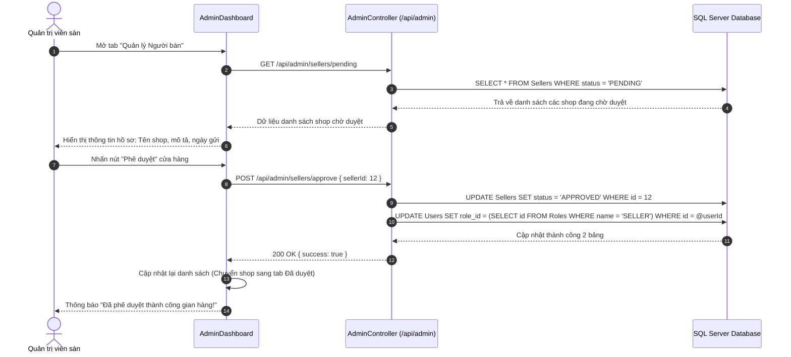
```mermaid
sequenceDiagram
    autonumber
    actor Admin as Quản trị viên sàn
    participant Dashboard as AdminDashboard
    participant Controller as AdminController (/api/admin)
    participant DB as SQL Server Database

    Admin->>Dashboard: Mở tab "Quản lý Người bán"
    Dashboard->>Controller: GET /api/admin/sellers/pending
    Controller->>DB: SELECT * FROM Sellers WHERE status = 'PENDING'
    DB-->>Controller: Trả về danh sách các shop đang chờ duyệt
    Controller-->>Dashboard: Dữ liệu danh sách shop chờ duyệt
    Dashboard-->>Admin: Hiển thị thông tin hồ sơ: Tên shop, mô tả, ngày gửi
    Admin->>Dashboard: Nhấn nút "Phê duyệt" cửa hàng
    Dashboard->>Controller: POST /api/admin/sellers/approve { sellerId: 12 }
    Controller->>DB: UPDATE Sellers SET status = 'APPROVED' WHERE id = 12
    Controller->>DB: UPDATE Users SET role_id = (SELECT id FROM Roles WHERE name = 'SELLER') WHERE id = @userId
    DB-->>Controller: Cập nhật thành công 2 bảng
    Controller-->>Dashboard: 200 OK { success: true }
    Dashboard->>Dashboard: Cập nhật lại danh sách (Chuyển shop sang tab Đã duyệt)
    Dashboard-->>Admin: Thông báo "Đã phê duyệt thành công gian hàng!"
```

---

# 4. CÁC THÔNG TIN HỖ TRỢ KHÁC

## 4.1 Yêu cầu phi chức năng (Non-Functional Requirements)
Các yêu cầu phi chức năng thiết lập các chỉ tiêu chất lượng kỹ thuật mà hệ thống SZSHOP phải thỏa mãn:

| Nhóm Yêu cầu | Tiêu chí kỹ thuật cụ thể | Phương pháp kiểm chứng & Chỉ số đo lường |
| :--- | :--- | :--- |
| **1. Hiệu năng (Performance)** | - Tốc độ dựng khung hình đồ họa 3D Three.js đạt tối thiểu 60 FPS trên các dòng máy tính phổ thông có GPU onboard. - Thời gian tải trang ban đầu (Time to Interactive - TTI) < 2.0 giây trên đường truyền 4G/Wifi tiêu chuẩn. - Thời gian phản hồi của các API nghiệp vụ cốt lõi (sản phẩm, giỏ hàng, đặt hàng) < 300ms. - Thời gian phản hồi luồng trợ lý AI Copilot bắt đầu xuất hiện ký tự đầu tiên (Time to First Token) < 1.5 giây. | Đo kiểm bằng công cụ Google Lighthouse, Chrome DevTools Performance Profiler và Apache JMeter với tải 1.000 người dùng đồng thời. |
| **2. Bảo mật (Security)** | - Toàn bộ thông tin mật khẩu tài khoản người dùng bắt buộc được băm bằng thuật toán an toàn tiêu chuẩn ngành (BCrypt với salt rounds >= 10 hoặc Argon2id). Không lưu trữ mật khẩu dạng rõ (plaintext). - Cơ chế xác thực sử dụng JSON Web Token (JWT) có chữ ký bí mật, thời hạn hết hạn (TTL) tối đa 24 giờ. - Mọi giao tiếp dữ liệu Client - Server bắt buộc mã hóa qua giao thức HTTPS / TLS 1.3. - Ngăn chặn triệt để các lỗ hổng OWASP Top 10: SQL Injection bằng Parameterized Queries, Cross-Site Scripting (XSS) bằng Data Sanitization, và Cross-Site Request Forgery (CSRF). | Kiểm tra mã nguồn định kỳ (Static Code Analysis) bằng SonarQube và công cụ kiểm thử bảo mật chuyên dụng. |
| **3. Độ tin cậy & Sẵn sàng (Reliability & Availability)** | - Hệ thống duy trì mức độ sẵn sàng dịch vụ tối thiểu 99.9% thời gian trong năm (High Availability). - Tích hợp cơ chế tự phục hồi kết nối CSDL (Auto-reconnect) và Fallback thông minh sang In-Memory Database khi mạng doanh nghiệp gặp sự cố ngắt kết nối cục bộ. - Bảo toàn tính toàn vẹn giao dịch tài chính theo nguyên lý ACID: Không xảy ra tình trạng trừ tiền nhưng không ghi nhận đơn hàng. | Kiểm thử kịch bản ngắt mạng máy chủ CSDL đột ngột và đánh giá cơ chế chuyển mạch dự phòng tự động. |
| **4. Tính khả dụng & Tương thích (Usability & Portability)** | - Giao diện thiết kế theo triết lý Mobile-First & Responsive Design: Tương thích hoàn hảo trên các độ phân giải màn hình từ 360px (Smartphone), 768px (Tablet), 1024px (Laptop) đến 1920px (Desktop Full HD). - Hỗ trợ thao tác cảm ứng tự nhiên (Touch Gestures): Vuốt để xoay mô hình 3D, kéo thả giỏ hàng, chạm thanh toán. - Màu sắc thương hiệu và độ tương phản tuân thủ tiêu chuẩn tiếp cận Web Accessibility (WCAG 2.1 Level AA). | Kiểm thử chéo trên các hệ điều hành (Windows 11, macOS, iOS, Android) và các trình duyệt (Chrome, Safari, Edge, Firefox). |

## 4.2 Thiết kế Cơ sở Dữ liệu Quan hệ Vật lý (11 Bảng SQL)
Cơ sở dữ liệu hệ thống SZSHOP được thiết kế chuẩn hóa mức 3NF (Third Normal Form) trên hệ quản trị Microsoft SQL Server, bao gồm 11 bảng quan hệ logic phản ánh trọn vẹn mô hình sàn thương mại điện tử đa người bán:

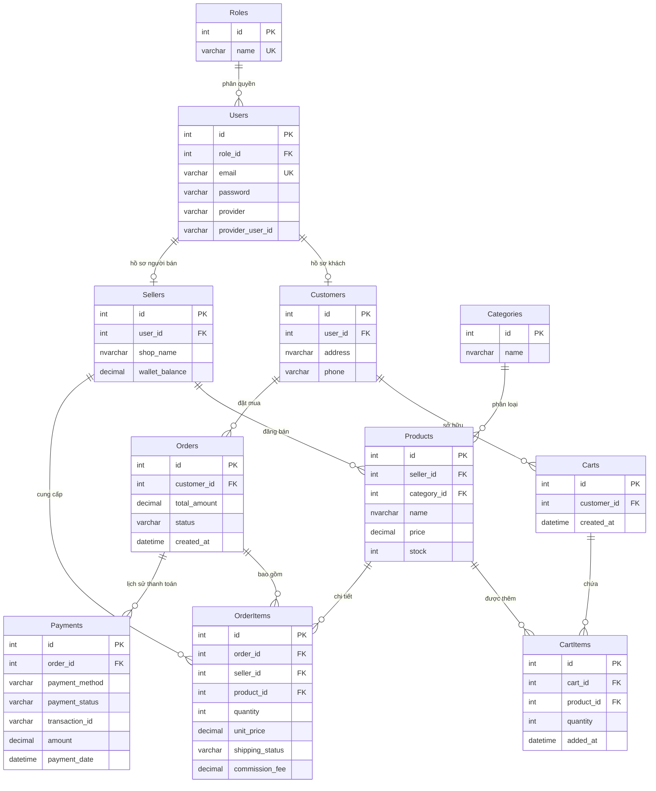
```mermaid
erDiagram
    Roles ||--o{ Users : "phân quyền"
    Users ||--o| Customers : "hồ sơ khách"
    Users ||--o| Sellers : "hồ sơ người bán"
    Sellers ||--o{ Products : "đăng bán"
    Categories ||--o{ Products : "phân loại"
    Customers ||--o{ Carts : "sở hữu"
    Carts ||--o{ CartItems : "chứa"
    Products ||--o{ CartItems : "được thêm"
    Customers ||--o{ Orders : "đặt mua"
    Orders ||--o{ OrderItems : "bao gồm"
    Sellers ||--o{ OrderItems : "cung cấp"
    Products ||--o{ OrderItems : "chi tiết"
    Orders ||--o{ Payments : "lịch sử thanh toán"

    Roles {
        int id PK
        varchar name UK
    }
    Users {
        int id PK
        int role_id FK
        varchar email UK
        varchar password
        varchar provider
        varchar provider_user_id
    }
    Customers {
        int id PK
        int user_id FK
        nvarchar address
        varchar phone
    }
    Sellers {
        int id PK
        int user_id FK
        nvarchar shop_name
        decimal wallet_balance
    }
    Categories {
        int id PK
        nvarchar name
    }
    Products {
        int id PK
        int seller_id FK
        int category_id FK
        nvarchar name
        decimal price
        int stock
    }
    Carts {
        int id PK
        int customer_id FK
        datetime created_at
    }
    CartItems {
        int id PK
        int cart_id FK
        int product_id FK
        int quantity
        datetime added_at
    }
    Orders {
        int id PK
        int customer_id FK
        decimal total_amount
        varchar status
        datetime created_at
    }
    OrderItems {
        int id PK
        int order_id FK
        int seller_id FK
        int product_id FK
        int quantity
        decimal unit_price
        varchar shipping_status
        decimal commission_fee
    }
    Payments {
        int id PK
        int order_id FK
        varchar payment_method
        varchar payment_status
        varchar transaction_id
        decimal amount
        datetime payment_date
    }
```

### Bảng đặc tả chi tiết 11 bảng Cơ sở dữ liệu:
1. **Bảng `Roles` (Phân quyền người dùng):**
   - `id` (INT, Primary Key, Identity): Mã định danh quyền hạn.
   - `name` (VARCHAR(50), Unique, Not Null): Tên quyền (`ADMIN`, `SELLER`, `CUSTOMER`).
2. **Bảng `Users` (Người dùng tổng thể):**
   - `id` (INT, Primary Key, Identity): Mã định danh tài khoản.
   - `role_id` (INT, Foreign Key -> `Roles.id`, Not Null): Quyền hạn tài khoản.
   - `email` (VARCHAR(255), Unique, Not Null): Địa chỉ email đăng nhập.
   - `password` (VARCHAR(255), Not Null): Chuỗi băm mật khẩu bảo mật.
   - `provider` (VARCHAR(50), Null): Nguồn đăng nhập một chạm (`google`, `facebook`, `apple`).
   - `provider_user_id` (VARCHAR(255), Null): Định danh tài khoản từ nhà cung cấp OAuth.
3. **Bảng `Customers` (Hồ sơ khách hàng):**
   - `id` (INT, Primary Key, Identity): Mã hồ sơ khách hàng.
   - `user_id` (INT, Foreign Key -> `Users.id`, Unique, Not Null): Khóa ngoại liên kết bảng Users.
   - `address` (NVARCHAR(255), Null): Địa chỉ giao nhận mặc định.
   - `phone` (VARCHAR(20), Null): Số điện thoại liên lạc.
4. **Bảng `Sellers` (Hồ sơ nhà bán lẻ):**
   - `id` (INT, Primary Key, Identity): Mã nhà bán hàng.
   - `user_id` (INT, Foreign Key -> `Users.id`, Unique, Not Null): Khóa ngoại liên kết bảng Users.
   - `shop_name` (NVARCHAR(150), Not Null): Tên thương hiệu gian hàng.
   - `wallet_balance` (DECIMAL(18,2), Default 0): Số dư tài khoản ví người bán để nhận tiền sau khi đơn giao thành công.
5. **Bảng `Categories` (Danh mục ngành hàng):**
   - `id` (INT, Primary Key, Identity): Mã danh mục sản phẩm.
   - `name` (NVARCHAR(100), Not Null): Tên danh mục (Thời trang nam, Thời trang nữ, Giày dép, Phụ kiện công nghệ).
6. **Bảng `Products` (Sản phẩm kinh doanh):**
   - `id` (INT, Primary Key, Identity): Mã sản phẩm.
   - `seller_id` (INT, Foreign Key -> `Sellers.id`, Not Null): Shop đăng bán sản phẩm.
   - `category_id` (INT, Foreign Key -> `Categories.id`, Null): Ngành hàng tương ứng.
   - `name` (NVARCHAR(255), Not Null): Tên gọi sản phẩm.
   - `price` (DECIMAL(18,2), Not Null): Đơn giá niêm yết.
   - `stock` (INT, Default 0): Số lượng sản phẩm còn tồn kho.
7. **Bảng `Carts` (Giỏ hàng người dùng):**
   - `id` (INT, Primary Key, Identity): Mã giỏ hàng.
   - `customer_id` (INT, Foreign Key -> `Customers.id`, Not Null): Chủ sở hữu giỏ hàng.
   - `created_at` (DATETIME, Default GETDATE()): Thời gian khởi tạo giỏ hàng.
8. **Bảng `CartItems` (Chi tiết mặt hàng trong giỏ):**
   - `id` (INT, Primary Key, Identity): Mã dòng giỏ hàng.
   - `cart_id` (INT, Foreign Key -> `Carts.id`, Not Null): Thuộc giỏ hàng nào.
   - `product_id` (INT, Foreign Key -> `Products.id`, Not Null): Sản phẩm được chọn.
   - `quantity` (INT, Default 1): Số lượng chọn mua.
   - `added_at` (DATETIME, Default GETDATE()): Thời điểm thêm vào giỏ.
9. **Bảng `Orders` (Đơn hàng gốc):**
   - `id` (INT, Primary Key, Identity): Mã đơn hàng định danh.
   - `customer_id` (INT, Foreign Key -> `Customers.id`, Not Null): Người đặt mua đơn hàng.
   - `total_amount` (DECIMAL(18,2), Not Null): Tổng giá trị thanh toán của đơn hàng.
   - `status` (VARCHAR(50), Not Null): Trạng thái đơn (`Pending`, `Paid`, `Shipping`, `Delivered`, `Cancelled`).
   - `created_at` (DATETIME, Default GETDATE()): Thời gian khởi tạo đơn hàng.
10. **Bảng `OrderItems` (Kiện hàng phân bổ cho từng Seller):**
    - `id` (INT, Primary Key, Identity): Mã chi tiết kiện hàng.
    - `order_id` (INT, Foreign Key -> `Orders.id`, Not Null): Thuộc đơn hàng gốc nào.
    - `seller_id` (INT, Foreign Key -> `Sellers.id`, Not Null): Shop chịu trách nhiệm giao hàng.
    - `product_id` (INT, Foreign Key -> `Products.id`, Not Null): Sản phẩm trong kiện.
    - `quantity` (INT, Not Null): Số lượng mặt hàng.
    - `unit_price` (DECIMAL(18,2), Not Null): Đơn giá tại thời điểm đặt mua.
    - `shipping_status` (VARCHAR(50), Not Null): Trạng thái vận chuyển của Shop.
    - `commission_fee` (DECIMAL(18,2), Null): Phí hoa hồng sàn thu từ đơn này.
11. **Bảng `Payments` (Lịch sử giao dịch thanh toán):**
    - `id` (INT, Primary Key, Identity): Mã định danh giao dịch.
    - `order_id` (INT, Foreign Key -> `Orders.id`, Not Null): Đơn hàng được thanh toán.
    - `payment_method` (VARCHAR(50), Not Null): Phương thức thanh toán (`VNPAY_QR`, `VIETQR`, `MOMO`, `CREDIT_CARD`, `COD`).
    - `payment_status` (VARCHAR(50), Not Null): Tình trạng xử lý (`Pending`, `Success`, `Failed`).
    - `transaction_id` (VARCHAR(100), Null): Mã tham chiếu giao dịch trả về từ ngân hàng/cổng thanh toán.
    - `amount` (DECIMAL(18,2), Not Null): Số tiền thực chuyển.
    - `payment_date` (DATETIME, Default GETDATE()): Thời điểm giao dịch được ghi nhận.

## 4.3 Ràng buộc Thiết kế & Kiến trúc Triển khai
- **Mô hình kiến trúc tổng thể:** Áp dụng mô hình đa tầng phân tách độc lập (N-Tier Decoupled Architecture):
  1. *Presentation Layer (Frontend):* Single Page Application (SPA) xây dựng trên nền React 19, TypeScript, Tailwind CSS, kết hợp Three.js cho việc kết xuất đồ họa không gian 3D.
  2. *API Gateway & Controller Layer (Backend):* Node.js kết hợp Express v5, quản lý xác thực bằng JWT middleware, điều hướng các endpoint RESTful chuẩn hóa `/api/auth`, `/api/products`, `/api/cart`, `/api/orders`, `/api/chat`.
  3. *Business Service & Repository Layer:* Phân tách rõ tầng dịch vụ nghiệp vụ (`services/`) và tầng truy cập cơ sở dữ liệu (`repositories/`), cô lập logic tính toán giỏ hàng, khuyến mãi và thanh toán.
  4. *Data Persistence Layer:* Hệ quản trị cơ sở dữ liệu quan hệ Microsoft SQL Server, kết hợp cơ chế Local In-Memory Fallback phục vụ môi trường offline/demo.
  5. *AI Intelligence Service Layer:* Tích hợp Gemini 1.5 API điều hướng qua cơ chế RAG Context Builder nhằm truy vấn tức thời dữ liệu sản phẩm trong CSDL trước khi sinh nội dung tư vấn.
- **Chiến lược đóng gói & Triển khai (Deployment Strategy):**
  - Frontend được biên dịch tĩnh tối ưu bằng Vite (`npm run build`), sẵn sàng triển khai trên CDN hoặc Web Server Nginx/Cloudflare Pages.
  - Backend chạy dưới dạng dịch vụ Node.js microservice (`node szshop-backend/server.js`), lắng nghe cổng nội bộ 5000, hỗ trợ đóng gói Docker container độc lập phục vụ horizontal scaling khi lượng truy cập tăng đột biến.

---
*Tài liệu Đặc tả Yêu cầu Phần mềm (SRS) cho Hệ thống SZSHOP được hoàn thiện đầy đủ, chuẩn hóa theo mẫu quy định và sẵn sàng cho các giai đoạn lập trình chi tiết, kiểm thử phần mềm và nghiệm thu dự án.*
