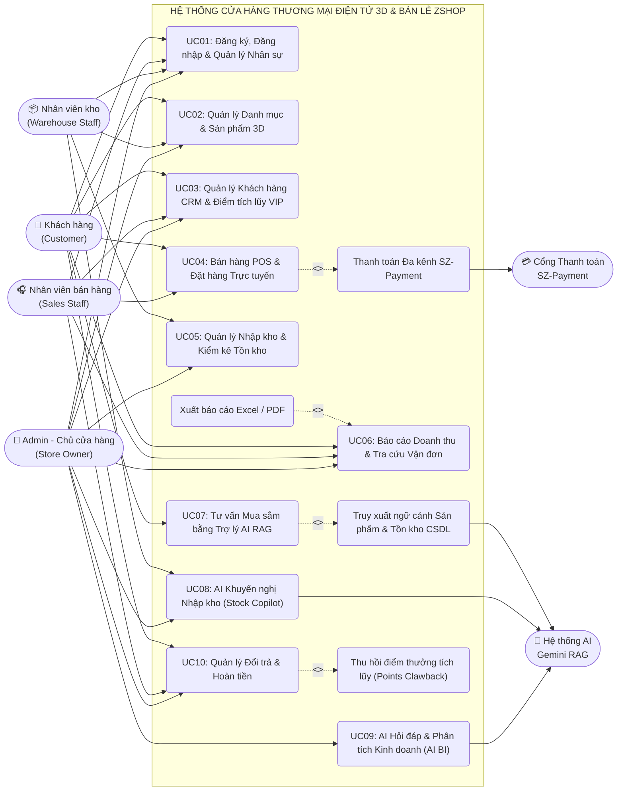
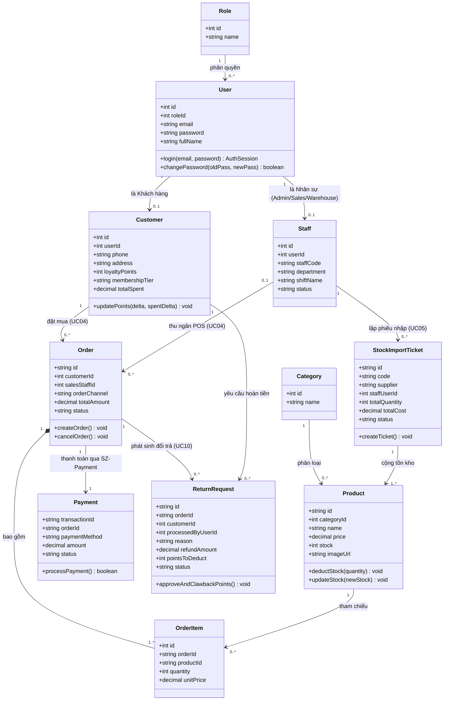
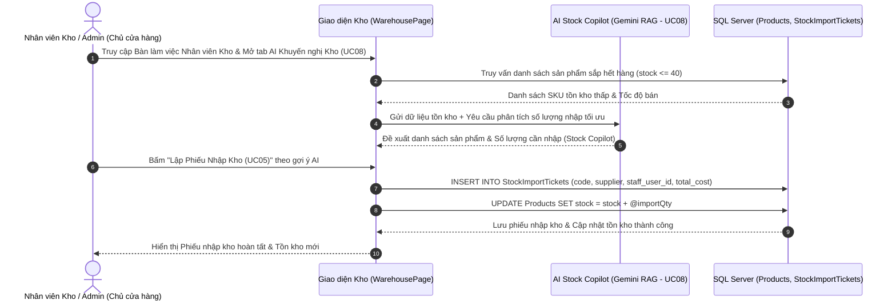
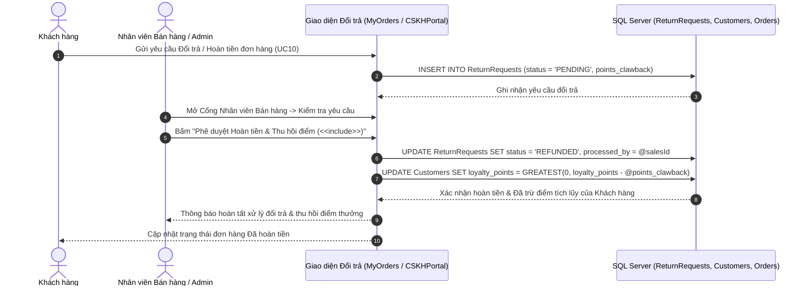

# Tài liệu Thiết kế Kiến trúc & Mô hình hóa Chuẩn UML 2.5 (Architecture & UML Design Document)

## 1. Tổng quan Kiến trúc Hệ thống (Layered Architecture)

Hệ thống **Cửa hàng Thương mại Điện tử 3D & Bán lẻ ZShop (Single-Store Model)** được thiết kế theo kiến trúc phân tầng **Client-Server (Layered Architecture)** tích hợp **RAG (Retrieval-Augmented Generation)** cho Trợ lý AI:

```text
┌─────────────────────────────────────────────────────────────────────────┐
│                    PRESENTATION LAYER (FRONTEND SPA)                    │
│          React 19 + TypeScript + Vite + Tailwind CSS + Three.js         │
│  - Phân hệ Khách hàng (Customer): 3D Spatial Canvas, Giỏ hàng, Đơn mua  │
│  - Phân hệ Nhân viên bán hàng (Sales Staff): POS tại quầy, CRM, Đổi trả │
│  - Phân hệ Nhân viên kho (Warehouse Staff): Nhập kho, Tồn kho, AI Kho   │
│  - Phân hệ Admin (Chủ cửa hàng): Báo cáo doanh thu, Nhân sự, AI BI      │
└────────────────────────────────────┬────────────────────────────────────┘
                                     │ HTTP REST API (Port 5000)
┌────────────────────────────────────▼────────────────────────────────────┐
│                        API & CONTROLLER LAYER                           │
│                     Express.js Router & Controllers                     │
│  - AuthController, ProductController, CartController, OrderController   │
└────────────────────────────────────┬────────────────────────────────────┘
                                     │
┌────────────────────────────────────▼────────────────────────────────────┐
│                            SERVICE LAYER                                │
│  - AiService (RAG Pipeline: Question Analysis -> Retriever -> Gemini)   │
│  - ProductService, CartService, OrderService, LoyaltyService            │
└────────────────────────────────────┬────────────────────────────────────┘
                                     │
┌────────────────────────────────────▼────────────────────────────────────┐
│                           REPOSITORY LAYER                              │
│  - Parameterized SQL Queries (Chống SQL Injection tuyệt đối)            │
└────────────────────────────────────┬────────────────────────────────────┘
                                     │ MSSQL Driver
┌────────────────────────────────────▼────────────────────────────────────┐
│                            DATABASE LAYER                               │
│              Microsoft SQL Server (11 Bảng Chuẩn 3NF)                   │
│  Roles (4 Tác nhân), Users, Customers, Staffs, Categories, Products,    │
│  StockImportTickets, Carts, CartItems, Orders, OrderItems, Payments,    │
│  ReturnRequests (Đã loại bỏ hoàn toàn bảng Sellers đa nhà bán hàng)     │
└─────────────────────────────────────────────────────────────────────────┘
```

---

## 2. Biểu đồ Use Case Tổng thể Chuẩn UML 2.5 (Overall Use Case Diagram)

Hệ thống thống nhất **4 Tác nhân chính (Primary Actors)** là con người:
1. **Khách hàng (`Customer`)**
2. **Nhân viên bán hàng (`Sales Staff`)**
3. **Nhân viên kho (`Warehouse Staff`)**
4. **Admin - Chủ cửa hàng (`Admin / Store Owner`)**

Cùng **2 Tác nhân hệ thống ngoài (Secondary Actors)**:
- **Cổng Thanh toán SZ-Payment (`Payment Gateway`)**
- **Dịch vụ AI Gemini RAG (`Gemini AI Service`)**



---

## 3. Biểu đồ Lớp Thiết kế Chuẩn UML 2.5 (Class Diagram)

Biểu đồ lớp thể hiện rõ mối quan hệ kế thừa / liên kết giữa **Người dùng (`User`)** với **Khách hàng (`Customer`)** và **Nhân sự nội bộ (`Staff`: `SalesStaff`, `WarehouseStaff`, `Admin`)**, cùng các thực thể nghiệp vụ của cửa hàng:



---

## 4. Biểu đồ Trình tự Chuẩn UML 2.5 (Sequence Diagrams)

### 4.1. Biểu đồ Trình tự UC04: Bán hàng POS & Đặt hàng Thanh toán SZ-Payment (`Khách hàng` / `Nhân viên bán hàng`)

```mermaid
sequenceDiagram
    autonumber
    actor Actor as Khách hàng / Nhân viên Bán hàng
    participant UI as Giao diện (CheckoutPage / POSPage)
    participant API as Order & Payment Service
    participant DB as SQL Server (Products, Orders, Customers)
    participant GW as Cổng SZ-Payment (VietQR / VNPAY)

    Actor->>UI: Chọn sản phẩm, kiểm tra giỏ hàng & chọn phương thức thanh toán
    UI->>API: POST /api/orders (items, customerId, channel, paymentMethod)
    API->>DB: Kiểm tra tồn kho (SELECT stock FROM Products WHERE id = @pid)
    alt Tồn kho đủ (stock >= quantity)
        API->>GW: Khởi tạo giao dịch thanh toán (VietQR Napas 247 / POS)
        GW-->>UI: Hiển thị mã QR động (15 phút) / Xác nhận thanh toán
        Actor->>GW: Quét mã QR thanh toán thành công
        GW-->>API: Webhook xác nhận trạng thái PAID (transactionId)
        API->>DB: INSERT Orders, OrderItems, Payments (status = 'PAID')
        API->>DB: UPDATE Products SET stock = stock - @qty (Trừ tồn kho)
        API->>DB: UPDATE Customers SET loyalty_points += @pts (Cộng điểm VIP - UC03)
        DB-->>API: Xác nhận hoàn tất Transaction ACID
        API-->>UI: Trả về Hóa đơn số & Mã vận đơn DH-XXXXXXXX
        UI-->>Actor: Hiển thị Hóa đơn thành công & Điểm thưởng mới
    else Hết hàng trong kho
        DB-->>API: Cảnh báo không đủ tồn kho
        API-->>UI: Trả về lỗi hết hàng
        UI-->>Actor: Thông báo điều chỉnh số lượng
    end
```

### 4.2. Biểu đồ Trình tự UC05 & UC08: AI Khuyến nghị Kho & Lập Phiếu Nhập Kho (`Nhân viên kho` / `Admin`)



### 4.3. Biểu đồ Trình tự UC10: Xử lý Đổi trả, Hoàn tiền & Thu hồi Điểm tích lũy (`Khách hàng` & `Nhân viên bán hàng`)


