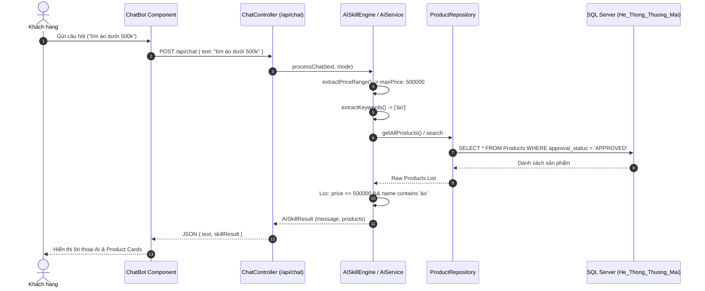

# Luồng Dữ liệu Chatbot (Chatbot Data Flow)

```mermaid
sequenceDiagram
    autonumber
    actor User as Khách hàng
    participant UI as ChatBot Component
    participant Controller as ChatController (/api/chat)
    participant Engine as AISkillEngine / AiService
    participant Repo as ProductRepository
    participant DB as SQL Server (He_Thong_Thuong_Mai)

    User->>UI: Gửi câu hỏi ("tìm áo dưới 500k")
    UI->>Controller: POST /api/chat { text: "tìm áo dưới 500k" }
    Controller->>Engine: processChat(text, mode)
    Engine->>Engine: extractPriceRange() -> maxPrice: 500000
    Engine->>Engine: extractKeywords() -> ['áo']
    Engine->>Repo: getAllProducts() / search
    Repo->>DB: SELECT * FROM Products WHERE approval_status = 'APPROVED'
    DB-->>Repo: Danh sách sản phẩm
    Repo-->>Engine: Raw Products List
    Engine->>Engine: Lọc: price <= 500000 && name contains 'áo'
    Engine-->>Controller: AISkillResult (message, products)
    Controller-->>UI: JSON { text, skillResult }
    UI-->>User: Hiển thị lời thoại AI & Product Cards
```
