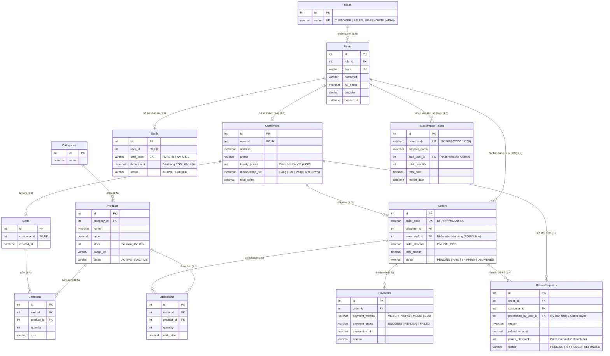

# Thiết kế Cơ sở Dữ liệu & Biểu đồ Thực thể Kết hợp (Database Design & ERD - Chuẩn UML)

## 1. Biểu đồ Thực thể Kết hợp (ERD - Entity Relationship Diagram)

Thiết kế cơ sở dữ liệu quan hệ chuẩn 3NF dành cho **Hệ thống Cửa hàng Thương mại Điện tử 3D & Bán lẻ ZShop (Single-Store Model)** phục vụ đúng **4 Tác nhân UML**: **Admin (Chủ cửa hàng)**, **Nhân viên bán hàng (`SALES`)**, **Nhân viên kho (`WAREHOUSE`)**, và **Khách hàng (`CUSTOMER`)** (loại bỏ hoàn toàn bảng Nhà bán hàng `Sellers` đa gian hàng):

## 2. Chi tiết Cấu trúc 11 Bảng Vật lý (SQL Server)

1. **`Roles` (Phân quyền 4 Tác nhân UML):** Lưu 4 vai trò chuẩn: `CUSTOMER` (Khách hàng), `SALES` (Nhân viên bán hàng), `WAREHOUSE` (Nhân viên kho), `ADMIN` (Chủ cửa hàng).
2. **`Users` (Tài khoản người dùng - UC01):** Lưu thông tin xác thực (`email`, `password`, `role_id`, `provider`).
3. **`Customers` (Hồ sơ Khách hàng & Điểm VIP - UC03):** Liên kết 1-1 với `Users`, quản lý địa chỉ, SĐT, `loyalty_points`, `membership_tier` và `total_spent`.
4. **`Staffs` (Hồ sơ Nhân sự Cửa hàng - UC01):** Thay thế hoàn toàn bảng `Sellers` cũ. Liên kết 1-1 với `Users` thuộc vai trò `SALES` hoặc `WAREHOUSE`, quản lý mã nhân viên (`staff_code`), bộ phận công tác và ca làm việc.
5. **`Categories` (Danh mục ngành hàng - UC02):** Phân loại sản phẩm của cửa hàng.
6. **`Products` (Sản phẩm cửa hàng - UC02, UC07, UC08):** Lưu trực tiếp danh mục hàng hóa của cửa hàng ZShop (`name`, `price`, `stock`, `image_url`).
7. **`StockImportTickets` (Phiếu nhập kho - UC05):** Lưu lịch sử nhập hàng từ nhà cung cấp do Nhân viên kho hoặc Admin thực hiện.
8. **`Carts` & `CartItems` (Giỏ hàng - UC04):** Lưu giỏ hàng trực tuyến của Khách hàng.
9. **`Orders` & `OrderItems` (Đơn hàng Online & Tại quầy POS - UC04, UC06):** Lưu đơn đặt hàng từ cả 2 kênh `ONLINE` (Khách hàng tự đặt) và `POS` (Nhân viên bán hàng tạo tại quầy).
10. **`Payments` (Giao dịch cổng thanh toán SZ-Payment - UC04):** Đối soát giao dịch VietQR Napas 247, VNPAY, MoMo, Thẻ quốc tế và COD.
11. **`ReturnRequests` (Yêu cầu Đổi trả & Hoàn tiền - UC10):** Lưu yêu cầu đổi trả của Khách hàng, số tiền hoàn (`refund_amount`) và số điểm tích lũy bị thu hồi (`points_clawback`) do Nhân viên bán hàng hoặc Admin xử lý.
